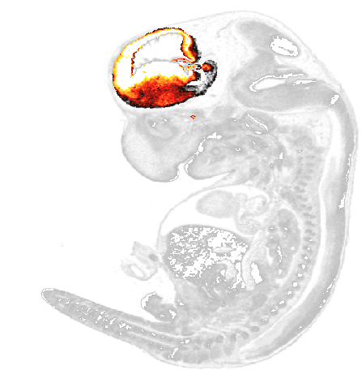

#brainmapr

`brainmapr` visualizes and analyzes 3D ISH gene expression data from the Allen Brain Atlas. Our goal in developing `brainmapr` was to spatially place groups of neuronal cells within a region of the brain on interest based on their gene expression signatures identified from single cell RNA-seq.

## Installation
`install_github("JEFworks/brainmapr")`

## Sample images/output
Projection of an embryonic 13.5 day old mouse  

Forebrain highlighted structure highlighted in a slice of an embryonic 13.5 day old mouse  

Gene expression signature for a proximal distal group of neurons within the forebrain of an embryonic 13.5 day old mouse  

## Vignettes
[Getting Started with brainmapr](vignettes/brainmapr-vignette.pdf)  
[Practical applications of brainmapr](vignettes/pagoda-vignette.pdf)
