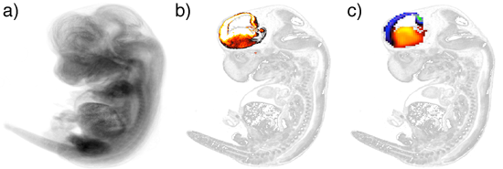

#brainmapr 

[](https://travis-ci.org/hms-dbmi/brainmapr) [](http://codecov.io/github/hms-dbmi/brainmapr?branch=master)  

Spatial localization of neural progenitor cells within the developing mammalian brain plays an important role in neuronal fate determination and maturation. We developed `brainmapr` to the infer spatial location of neural progenitor subpopulations within the developing mouse brain by integrating single-cell RNA-seq data with in situ RNA patterns from the [Allen Developing Mouse Brain Atlas](http://mouse.brain-map.org/). Putative neural progenitor subpopulations are first identified using single-cell RNA-seq data. [Single cell differential expression](http://pklab.med.harvard.edu/scde/index.html) analysis identifies gene expression signatures associated with each subpopulation. In situ expression patterns for these genes then spatially localize each subpopulation to demonstrate spatial segregation of subpopulations. 

The `brainmapr` package comes pre-loaded with a small sample of ISH data for 38 genes in the embryonic 11.5 day old mouse. Additional ISH data for ~2000 genes in convenient RData formats are available for the embryonic 11.5, 13.5, 15.5, 16.5, and 18.5, and post-natal 4, 14, 28, and 56 day old mice and can be downloaded from the [Kharchenko lab website](http://pklab.med.harvard.edu/jean/brainmapr/data-raw/) due to file size limitations on GitHub. By providing these data formats, we hope to enable investigators to explore trends in spatial correlation of gene expression or perform other statistical analyses from within the R statistical framework. 

ISH data are quantified as gene expression energies, defined expression intensity times expression density, at a grid voxel level. Each voxel corresponds to 100 µm gridding of the original ISH stain images and corresponds to voxel level structure annotations according to the accompanying developmental reference atlas ontology. The 3-D reference model for the developing 13.5 day embryonic mouse derived from Feulgen-HP yellow DNA staining is also used as a higher resolution reference image. Please refer to the [Allen Developing Mouse Brain Atlas Documentation](http://help.brain-map.org/display/mousebrain/Documentation) for more information on processes and procedures used to perform ISH, informatics data processing, structure annotation, and more. 

---

## Sample Images

  
Sample images generated using `brainmapr`. a) Projection of an embryonic 13.5 day old mouse; b) Forebrain highlighted structure in a slice of an embryonic 13.5 day old mouse; c) Gene expression signature for a proximal distal group of neurons within the forebrain of an embryonic 13.5 day old mouse  

---

## Usage

Please see the following vignettes for usage examples:  
- [Getting Started with brainmapr](vignettes/brainmapr-vignette.md) 
- [Practical applications of brainmapr](vignettes/pagoda-vignette.md)  

---

## Install
```
require(devtools)
devtools::install_github("hms-dbmi/brainmapr")
```

---

## Citation

### Allen Developing Mouse Brain Atlas

Website: ©2013 Allen Institute for Brain Science. Allen Developing Mouse Brain Atlas [Internet]. Available from: http://developingmouse.brain-map.org.

### brainmapr

"Characterizing transcriptional heterogeneity through pathway and gene set overdispersion analysis" (Fan J, Salathia N, Liu R, Kaeser G, Yung Y, Herman J, Kaper F, Fan JB, Zhang K, Chun J, and Kharchenko PV) COMING SOON!

---

## Other similar methods:  
- [Achim K, Pettit JB, Saraiva LR, et al. High-throughput spatial mapping of single-cell RNA-seq data to tissue of origin. Nat Biotechnol. 2015;33(5):503-9.](http://www.ncbi.nlm.nih.gov/pubmed/25867922)  
- [Satija R, Farrell JA, Gennert D, Schier AF, Regev A. Spatial reconstruction of single-cell gene expression data. Nat Biotechnol. 2015;33(5):495-502.](http://www.ncbi.nlm.nih.gov/pubmed/25867923)  

--- 

## Contributing

We welcome any bug reports, enhancement requests, and other contributions. To submit a bug report or enhancement request, please use the [`brainmapr` GitHub issues tracker](https://github.com/hms-dbmi/brainmapr/issues). For more substantial contributions, please fork this repo, push your changes to your fork, and submit a pull request with a good commit message.


