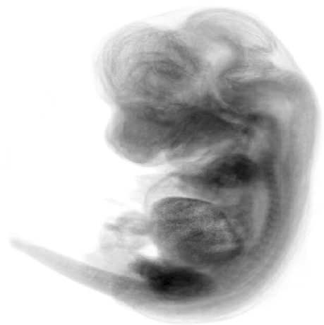
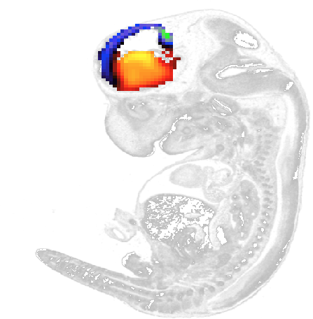

#brainmapr 

[](https://travis-ci.org/JEFworks/brainmapr) [](http://codecov.io/github/JEFworks/brainmapr?branch=master)  

Spatial localization of neural progenitor cells within the developing mammalian brain plays an important role in neuronal fate determination and maturation. We developed `brainmapr` to the infer spatial location of neural progenitor subpopulations within the developing mouse brain by integrating single-cell RNA-seq data with in situ RNA patterns from the [Allen Developing Mouse Brain Atlas](http://mouse.brain-map.org/). Putative neural progenitor subpopulations are first identified using single-cell RNA-seq data. [Single cell differential expression](http://pklab.med.harvard.edu/scde/index.html) analysis identifies gene expression signatures associated with each subpopulation. In situ expression patterns for these genes then spatially localize each subpopulation to demonstrate spatial segregation of subpopulations. 

The `brainmapr` package comes pre-loaded with a small sample of ISH data for 38 genes in the embryonic 11.5 day old mouse. Additional ISH data for ~2000 genes in convenient RData formats are available for the embryonic 11.5, 13.5, 15.5, 16.5, and 18.5, and post-natal 4, 14, 28, and 56 day old mice and can be downloaded from the [Kharchenko lab website](http://pklab.med.harvard.edu/jean/brainmapr/data-raw/) due to file size limitations on GitHub. 

Please refer to the [Allen Developing Mouse Brain Atlas Documentation](http://help.brain-map.org/display/mousebrain/Documentation) for specific information on processes and procedures used to perform ISH, informatics data processing, structure annotation, and more. 

---

## Citation

### Allen Developing Mouse Brain Atlas

Website: ©2013 Allen Institute for Brain Science. Allen Developing Mouse Brain Atlas [Internet]. Available from: http://developingmouse.brain-map.org.

### brainmapr
[coming soon]

---

## Install
```
require(devtools)
devtools::install_github("JEFworks/brainmapr")
```

---

## Usage

### Vignettes

Please see the following vignettes for usage examples:  
- [Getting Started with brainmapr](vignettes/brainmapr-vignette.md) 
- [Practical applications of brainmapr](vignettes/pagoda-vignette.md)  

### Sample images/output

Projection of an embryonic 13.5 day old mouse


Forebrain highlighted structure in a slice of an embryonic 13.5 day old mouse


Gene expression signature for a proximal distal group of neurons within the forebrain of an embryonic 13.5 day old mouse



