`brainmapr` visualizes 3D ISH gene expression data from the Allen Brain Atlas. Our goal is to spatially place a group of neuronal cells within a region of the brain based on their gene expression signature. 

## Getting Started


```r
library(brainmapr)
## included datasets
invisible(structureID)
invisible(vol3D)
invisible(annot3D)
invisible(gannot3D)
invisible(mat)
```

## Plotting

Plot an x-ray of the whole mouse. Note the mouse is upside-down on the slide.


```r
plot.projection.xray(vol3D, t=8)
s <- 15 # slice
s2 <- round(s/dim(gannot3D)[3]*dim(vol3D)[3]) # convert
plot.slice.xray(vol3D, s2, t=8)
```

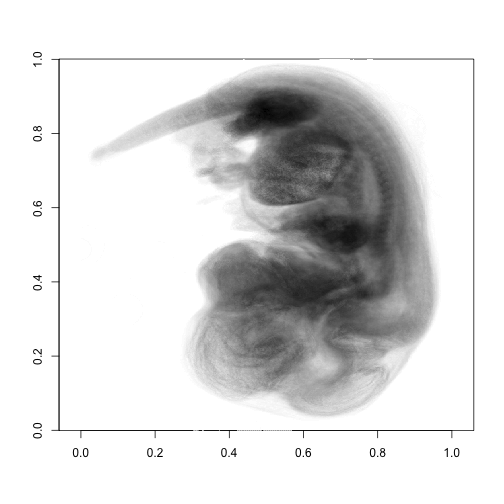 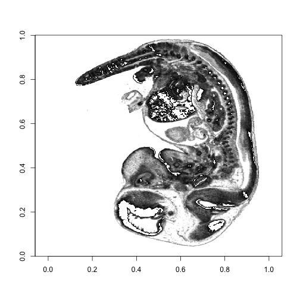 

Browse for structures of interest.


```r
get.ids(structureID, 'brain')
```

```
##                                                               forebrain 
##                                                                   15566 
##                                                                midbrain 
##                                                                   16649 
##                                                               hindbrain 
##                                                                   16808 
## mesencephalic trigeminal tract (across m1, m2 and prepontine hindbrain) 
##                                                                   17740 
##                                                   ventricles, forebrain 
##                                                               126651562 
##                                                    ventricles, midbrain 
##                                                               126651722 
##                                                   ventricles, hindbrain 
##                                                               126651782
```

Browse for genes of interest.

```r
head(rownames(mat))
```

```
## [1] "Dcx"     "Sox11"   "Cited2"  "Plxna2"  "Neurod6" "Tubb3"
```

Plot an x-ray of just the brain component of interest.


```r
cids1 <- get.structure.ids(structureID, 'midbrain')
cids2 <- get.structure.ids(structureID, 'ventricles, midbrain')
cids3 <- get.structure.ids(structureID, 'forebrain')
cids4 <- get.structure.ids(structureID, 'ventricles, forebrain')
cids5 <- get.structure.ids(structureID, 'hindbrain')
cids6 <- get.structure.ids(structureID, 'ventricles, hindbrain')
cids <- c(cids1, cids2, cids3, cids4, cids5, cids6)
sect3D <- structure.plot(cids, vol3D, annot3D, plot=F)
plot.projection.xray(vol3D, col=colorRampPalette(c("white", "grey"),space="Lab")(100), t=8)
plot.projection(sect3D, t=8, add=T)
plot.slice.xray(vol3D, s2, col=colorRampPalette(c("white", "grey"),space="Lab")(100), t=8)
plot.slice(sect3D, s2, t=8, add=T)
```

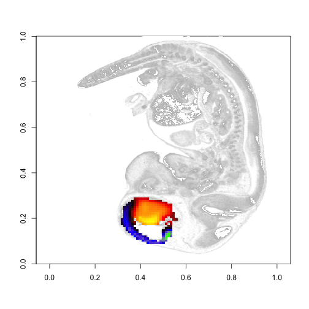 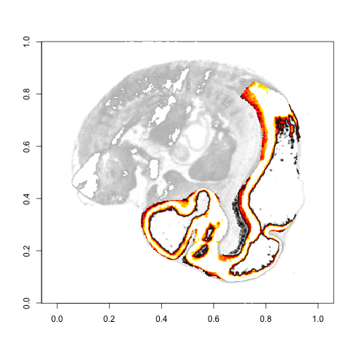 

Plot expression of `Dcx` gene.


```r
gp3D <- gene.plot('Dcx', mat, gannot3D, plot=F)
```

```
## [1] "Genes available:"
## [1] "Dcx"
## [1] "Genes not available:"
## character(0)
```

```r
plot.projection.xray(vol3D, col=colorRampPalette(c("white", "grey"),space="Lab")(100), t=8)
plot.projection(gp3D, t=1, add=T)
plot.slice.xray(vol3D, s2, col=colorRampPalette(c("white", "grey"),space="Lab")(100), t=8)
plot.slice(gp3D, s, t=1, add=T)
```

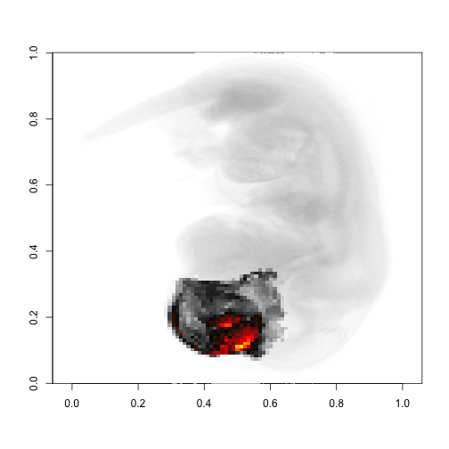 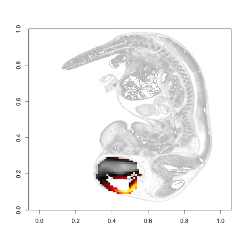 

Plot expression of `Dcx` gene within brain structure of interest.


```r
gpsect3D <- structure.plot(cids, gp3D, gannot3D, plot=F)
plot.projection.xray(vol3D, col=colorRampPalette(c("white", "grey"),space="Lab")(100), t=8)
plot.projection(gpsect3D, t=1, add=T)
plot.slice.xray(vol3D, s2, col=colorRampPalette(c("white", "grey"),space="Lab")(100), t=8)
plot.slice(gpsect3D, s, t=1, add=T)
```

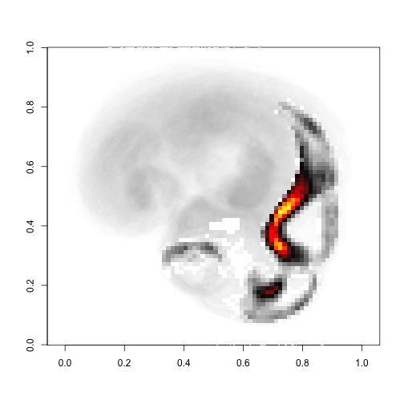  

Repeat for `Sox11` gene.


```r
gp3D <- gene.plot('Sox11', mat, gannot3D, plot=F)
```

```
## [1] "Genes available:"
## [1] "Sox11"
## [1] "Genes not available:"
## character(0)
```

```r
plot.projection.xray(vol3D, col=colorRampPalette(c("white", "grey"),space="Lab")(100), t=8)
plot.projection(gp3D, t=1, add=T)
plot.slice.xray(vol3D, s2, col=colorRampPalette(c("white", "grey"),space="Lab")(100), t=8)
plot.slice(gp3D, s, t=1, add=T)
```

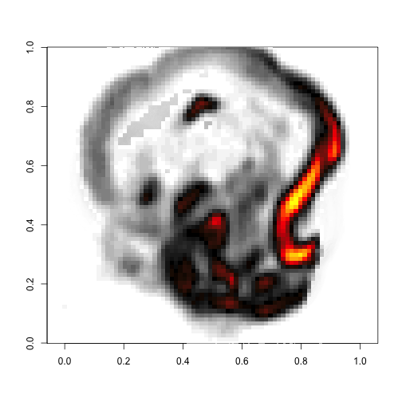 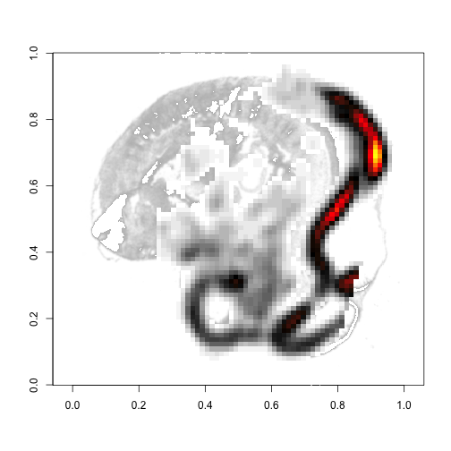 

```r
gpsect3D <- structure.plot(cids, gp3D, gannot3D, plot=F)
plot.projection.xray(vol3D, col=colorRampPalette(c("white", "grey"),space="Lab")(100), t=8)
plot.projection(gpsect3D, t=1, add=T)
plot.slice.xray(vol3D, s2, col=colorRampPalette(c("white", "grey"),space="Lab")(100), t=8)
plot.slice(gpsect3D, s, t=1, add=T)
```

 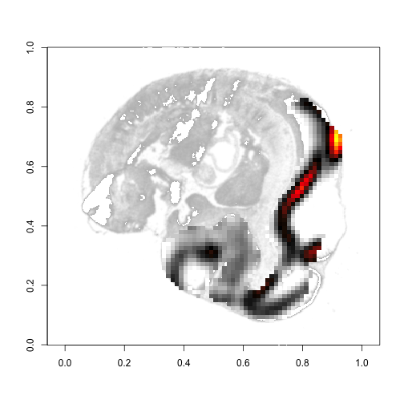 

Plot expression of a group of genes within the structure of interest. Weigh expressions equally by default.


```r
gl <- c("Dcx", "Sox11", "FAKEGENE")
gp3D <- gene.plot(gl, mat, gannot3D, t=1, plot=F)
```

```
## [1] "Genes available:"
## [1] "Dcx"   "Sox11"
## [1] "Genes not available:"
## [1] "FAKEGENE"
```

```r
gpsect3D <- structure.plot(cids, gp3D, gannot3D, plot=F)
plot.projection.xray(vol3D, col=colorRampPalette(c("white", "grey"),space="Lab")(100), t=8)
plot.projection(gpsect3D, t=1, add=T)
plot.slice.xray(vol3D, s2, col=colorRampPalette(c("white", "grey"),space="Lab")(100), t=8)
plot.slice(gpsect3D, s, t=1, add=T)
```

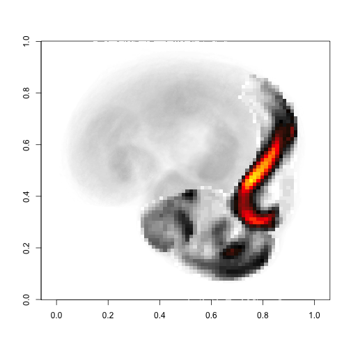 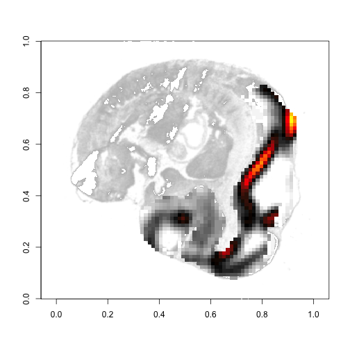 

Weigh unequally. Weights are relatively. 


```r
gl <- c("Dcx", "Sox11", "FAKEGENE")
weights <- c(1, 0.01, 1)
gp3D <- gene.plot(gl, mat, gannot3D, t=1, plot=F, weights=weights)
```

```
## [1] "Genes available:"
## [1] "Dcx"   "Sox11"
## [1] "Genes not available:"
## [1] "FAKEGENE"
```

```r
gpsect3D <- structure.plot(cids, gp3D, gannot3D, plot=F)
plot.projection.xray(vol3D, col=colorRampPalette(c("white", "grey"),space="Lab")(100), t=8)
plot.projection(gpsect3D, t=1, add=T)
plot.slice.xray(vol3D, s2, col=colorRampPalette(c("white", "grey"),space="Lab")(100), t=8)
plot.slice(gpsect3D, s, t=1, add=T)
```

 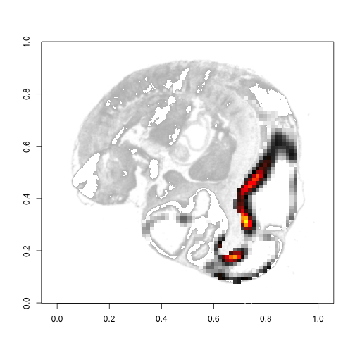 
