`brainmapr` visualizes 3D ISH gene expression data from the Allen Brain Atlas. 

The `brainmapr` package comes pre-loaded with a small sample of ISH data for 38 genes in the embryonic 11.5 day old mouse. Additional ISH data for ~2000 genes in convenient RData formats are available for the embryonic 11.5, 13.5, 15.5, 16.5, and 18.5, and post-natal 4, 14, 28, and 56 day old mice and can be downloaded from the [Kharchenko lab website](http://pklab.med.harvard.edu/jean/brainmapr/data-raw/) due to file size limitations on GitHub. By providing these data formats, we hope to enable investigators to explore trends in spatial correlation of gene expression or perform other statistical analyses from within the R statistical framework. 

In this vignette, we will work with the pre-loaded subset of ISH data to introduce a few common and useful methods in the `brainmapr` package. 

## Getting Started

To get started, load the `brainmapr` package. A number of datasets are already included and will be used in this vignette. Consult the R Documentation to learn more about each dataset.

```r
library(brainmapr)
## included datasets
invisible(structureID)
?structureID
invisible(vol3D)
?vol3D
invisible(annot3D)
?annot3D
invisible(gannot3D)
?gannot3D
invisible(mat) 
?mat
```

## Plotting

We will first visualize a sagittal projection of the whole embryonic 11.5 day old mouse. Note that the mouse is upside-down on the slide. We will also visualize a sagittal slice of the whole embryonic 11.5 day old mouse. Note that the indices of the slice is limited to the dimensions of the 3D volume. Because 3D ISH data for individual genes are provided on a voxel level, while whole mouse volume data is provided on a pixel level, we will need to convert from a voxel to pixel level slice index in order to make consistent and comparable slices. 


```r
plotProjectionXray(vol3D, t=8)
s <- 15 # voxel-level slice index
s2 <- round(s/dim(gannot3D)[3]*dim(vol3D)[3]) # convert to pixel-level slice index
plotSliceXray(vol3D, s2, t=8)
```

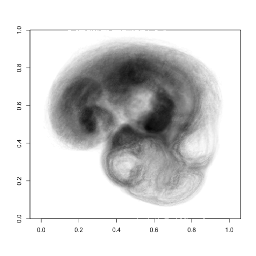 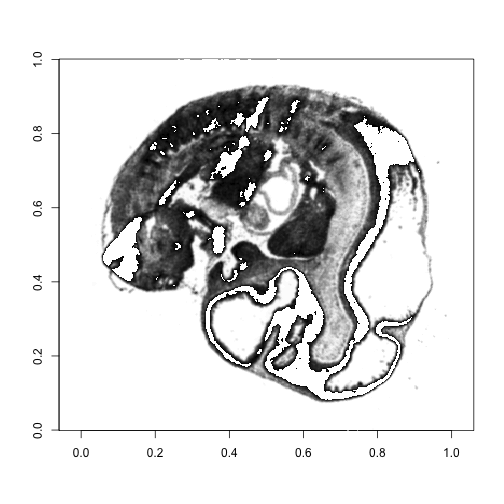 

We can browse for structures that contain the substring 'brain'. All structures of interest are available in the `structureID` object.


```r
getIds(structureID, 'brain')
```

```
##                                                               forebrain 
##                                                                   15566 
##                                                                midbrain 
##                                                                   16649 
##                                                               hindbrain 
##                                                                   16808 
## mesencephalic trigeminal tract (across m1, m2 and prepontine hindbrain) 
##                                                                   17740 
##                                                   ventricles, forebrain 
##                                                               126651562 
##                                                    ventricles, midbrain 
##                                                               126651722 
##                                                   ventricles, hindbrain 
##                                                               126651782
```

ISH data for a subset of 38 genes are included in this example dataset. We can browse these genes.

```r
head(rownames(mat))
```

```
## [1] "Dcx"     "Sox11"   "Cited2"  "Plxna2"  "Neurod6" "Tubb3"
```

We can restrict analyses to simply the brain component of interest as opposed to the entire mouse embryo. In this example, let's consider only the midbrain and hindbrain and associated ventricles. Let's plot a projection and slice of just the brain components of interest.


```r
cids <- c(getStructureIds(structureID, 'midbrain'),
          getStructureIds(structureID, 'ventricles, midbrain'),
          getStructureIds(structureID, 'hindbrain'),
          getStructureIds(structureID, 'ventricles, hindbrain')
)
sect3D <- structurePlot(cids, vol3D, annot3D, plot=F)
plotProjection(vol3D, col=colorRampPalette(c("white", "grey"),space="Lab")(100), t=8)
plotProjection(sect3D, t=8, add=T)
plotSlice(vol3D, s2, col=colorRampPalette(c("white", "grey"),space="Lab")(100), t=8)
plotSlice(sect3D, s2, t=8, add=T)
```

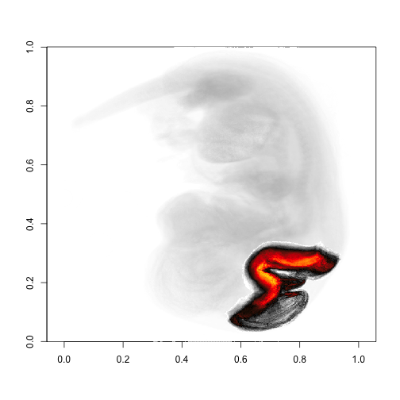 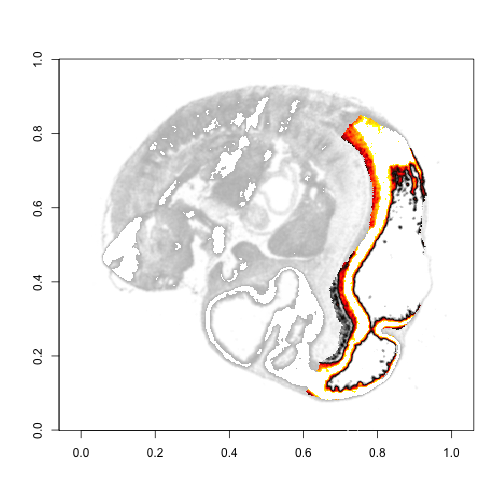 

We can also view expression of a particular gene within the mouse embryo. Let's plot expression of `Dcx` gene.


```r
gp3D <- genePlot('Dcx', mat, gannot3D, plot=F)
```

```
## [1] "Genes available:"
## [1] "Dcx"
## [1] "Genes not available:"
## character(0)
```

```r
plotProjection(vol3D, col=colorRampPalette(c("white", "grey"),space="Lab")(100), t=8)
plotProjection(gp3D, t=1, add=T)
plotSlice(vol3D, s2, col=colorRampPalette(c("white", "grey"),space="Lab")(100), t=8)
plotSlice(gp3D, s, t=1, add=T)
```

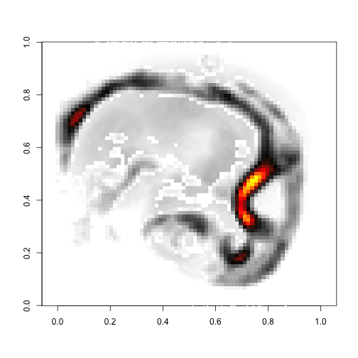 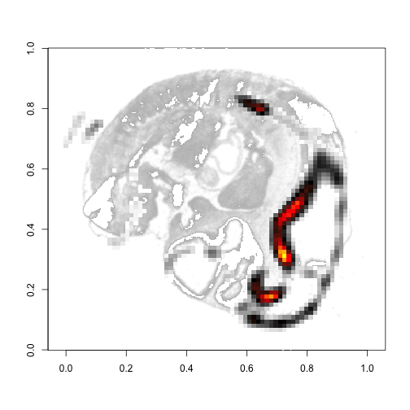 

We may want to restrict viewing expression of a particular gene to just the brain structures of interest. Let's plot expression of `Dcx` gene within the midbrain and hindbrain and associated ventricles.


```r
gpsect3D <- structurePlot(cids, gp3D, gannot3D, plot=F)
plotProjection(vol3D, col=colorRampPalette(c("white", "grey"),space="Lab")(100), t=8)
plotProjection(gpsect3D, t=1, add=T)
plotSlice(vol3D, s2, col=colorRampPalette(c("white", "grey"),space="Lab")(100), t=8)
plotSlice(gpsect3D, s, t=1, add=T)
```

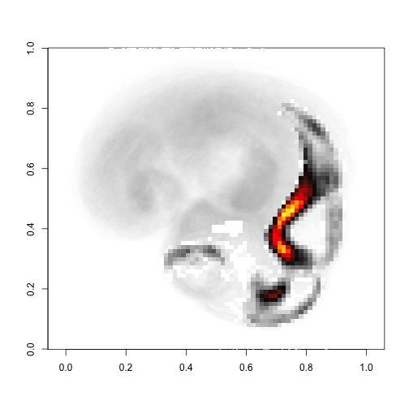  

As a comparison, we can repeat this process for the `Sox11` gene.


```r
gp3D <- genePlot('Sox11', mat, gannot3D, plot=F)
```

```
## [1] "Genes available:"
## [1] "Sox11"
## [1] "Genes not available:"
## character(0)
```

```r
plotProjection(vol3D, col=colorRampPalette(c("white", "grey"),space="Lab")(100), t=8)
plotProjection(gp3D, t=1, add=T)
plotSlice(vol3D, s2, col=colorRampPalette(c("white", "grey"),space="Lab")(100), t=8)
plotSlice(gp3D, s, t=1, add=T)
```

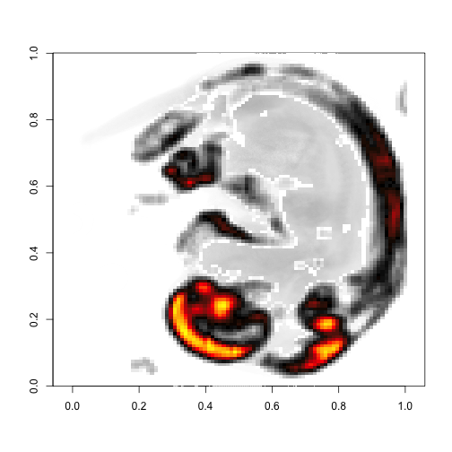 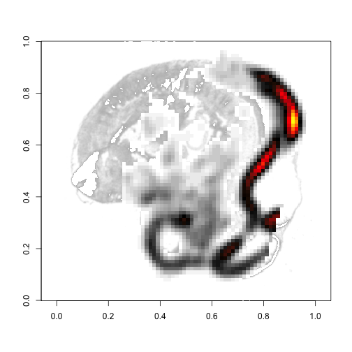 

```r
gpsect3D <- structurePlot(cids, gp3D, gannot3D, plot=F)
plotProjection(vol3D, col=colorRampPalette(c("white", "grey"),space="Lab")(100), t=8)
plotProjection(gpsect3D, t=1, add=T)
plotSlice(vol3D, s2, col=colorRampPalette(c("white", "grey"),space="Lab")(100), t=8)
plotSlice(gpsect3D, s, t=1, add=T)
```

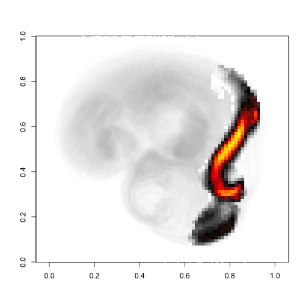 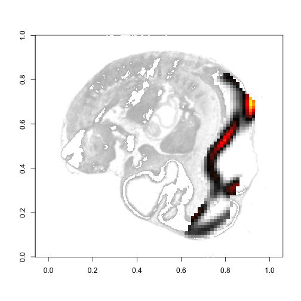 

We often want to plot the expression of a group of genes within the brain structure of interest. These groups of genes may be associated with a neuronal cell subpopulation of interest. By looking at where genes associated with the subpopulation is expressed, we may be able to spatially localize these subpopulations. In this example, we will first weigh the gene expressions equally by default.


```r
gl <- c("Dcx", "Sox11", "FAKEGENE")
gp3D <- genePlot(gl, mat, gannot3D, t=1, plot=F)
```

```
## [1] "Genes available:"
## [1] "Dcx"   "Sox11"
## [1] "Genes not available:"
## [1] "FAKEGENE"
```

```r
gpsect3D <- structurePlot(cids, gp3D, gannot3D, plot=F)
plotProjection(vol3D, col=colorRampPalette(c("white", "grey"),space="Lab")(100), t=8)
plotProjection(gpsect3D, t=1, add=T)
plotSlice(vol3D, s2, col=colorRampPalette(c("white", "grey"),space="Lab")(100), t=8)
plotSlice(gpsect3D, s, t=1, add=T)
```

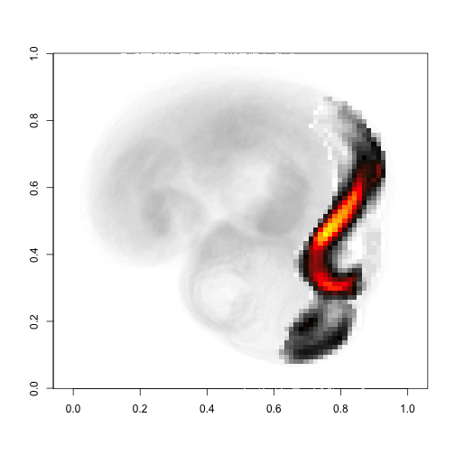 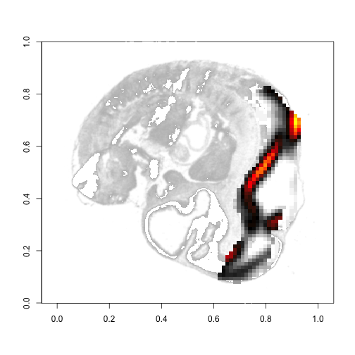 

Some times, certain genes contribute more to a neuronal cell subpopulation's gene expression signature. In such a scenario, we would want to weigh gene expressions unequally. Weights to consider using include -log10(p-values or q-values) or log2(fold change). Note weights are relatively. 


```r
gl <- c("Dcx", "Sox11", "FAKEGENE")
weights <- c(1, 0.01, 1)
gp3D <- genePlot(gl, mat, gannot3D, t=1, plot=F, weights=weights)
```

```
## [1] "Genes available:"
## [1] "Dcx"   "Sox11"
## [1] "Genes not available:"
## [1] "FAKEGENE"
```

```r
gpsect3D <- structurePlot(cids, gp3D, gannot3D, plot=F)
plotProjection(vol3D, col=colorRampPalette(c("white", "grey"),space="Lab")(100), t=8)
plotProjection(gpsect3D, t=1, add=T)
plotSlice(vol3D, s2, col=colorRampPalette(c("white", "grey"),space="Lab")(100), t=8)
plotSlice(gpsect3D, s, t=1, add=T)
```

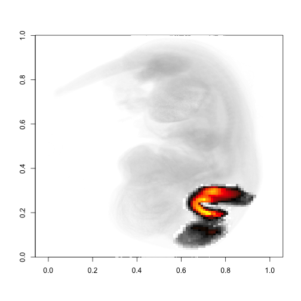 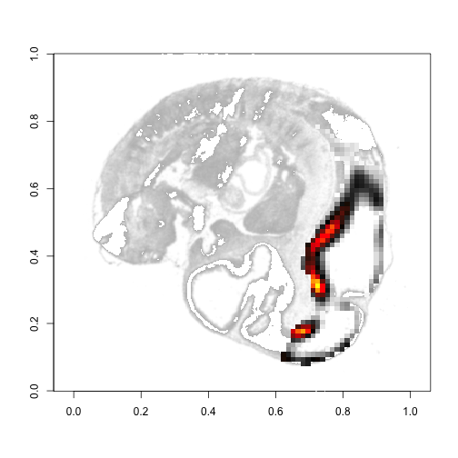 

In summary, this vignette has shown you how to plot projections and slices for whole embryonic mice, particular brain structures, genes, or groups of genes. For more information, please consult the R Documentation.
