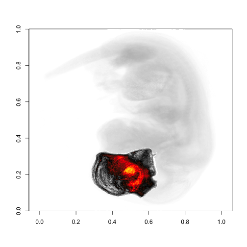
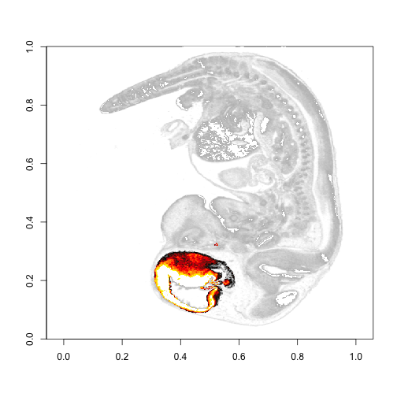
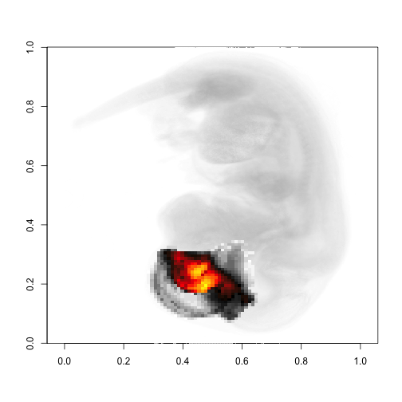
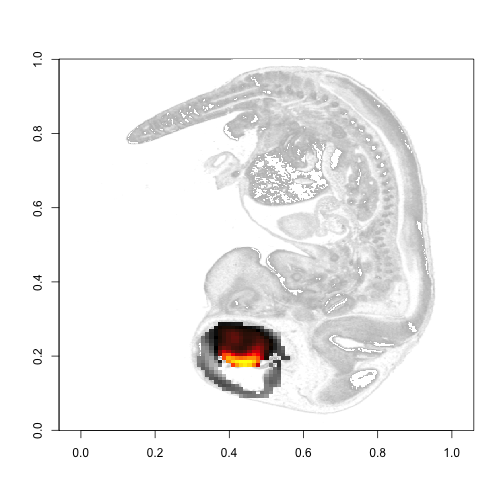
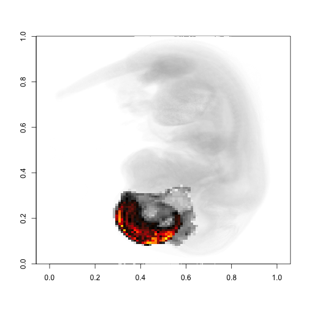
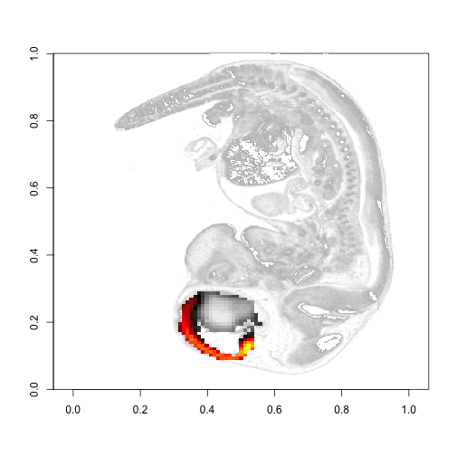
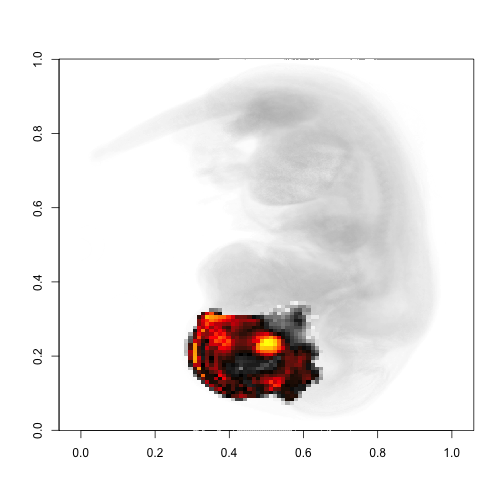
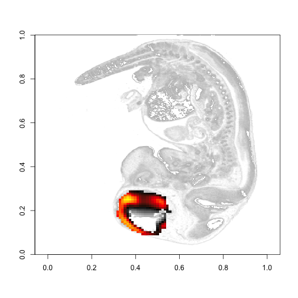
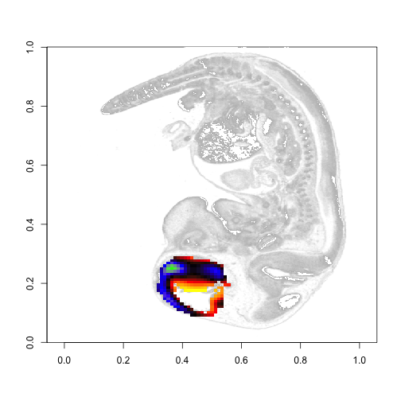

`brainmapr` visualizes 3D ISH gene expression data from the Allen Brain Atlas. Our goal is to spatially place a group of neuronal cells within a region of the brain based on their gene expression signature. This vignette recreates figures in [paper]

Load embryonic 13.5 day old mouse data. 


```r
library(brainmapr)
# Load data
load('../data-raw/RData/sids.RData')
load('../data-raw/RData/E13.5.energy.RData')
load('../data-raw/RData/E13.5.annot.RData')
```

Plot slice of whole mouse.


```r
plot.projection.xray(vol3D, t=15)
s <- 26 # slice
s2 <- round(s/dim(gannot3D)[3]*dim(vol3D)[3]) # convert
plot.slice.xray(vol3D, s2, t=15)
```

  

Get forebrain.


```r
# Plot x-ray of just brain component
# Forebrain
cids1 <- get.structure.ids(structure.id, 'forebrain')
cids2 <- get.structure.ids(structure.id, 'ventricles, forebrain')
cids <- c(cids1, cids2)
# Plot brain component; note section annotation data is for the left hemisphere only
sect3D <- structure.plot(cids, vol3D, annot3D, plot=F)
plot.projection.xray(vol3D, col=colorRampPalette(c("white", "grey"),space="Lab")(100), t=8)
plot.projection(sect3D, t=8, add=T)
plot.slice.xray(vol3D, s2, col=colorRampPalette(c("white", "grey"),space="Lab")(100), t=8)
plot.slice(sect3D, s2, t=8, add=T)
```

  

Gene expression signatures for proximal distal cell group identified by `pagoda`.


```r
# Plot gene expression
# Upregulated genes
gl1  <- c("Dlx2", "Dlx6as1", "Sp9", "Pbx3", "Dlx5", "Dlx1", "Necap1", "Zfhx3", "Pou3f4", "Sec63", "Gdi1", "Rbp1", "Rbmx", "Nrxn3", "Map3k13", "Meis1", "Slc6a1", "Sp8", "Pbx1", "Dcx", "Gad2", "Sirt7", "Hmgcll1")
# lb * cZ
weights1 <- c(46.26915, 38.06011, 33.33369, 36.56755, 43.52929, 39.49066, 14.35763, 4.262908, 8.896505, 3.521533, 1.94611, 5.004284, 1.760767, 9.089976, 6.999584, 8.525134, 4.538585, 3.559675, 1.706482, 2.031702, 3.470824, 6.661706, 5.606481)
gp3D <- gene.plot(gl1, mat, gannot3D, plot=F, weights=weights1)
```

```
## [1] "Genes available:"
##  [1] "Dlx2"   "Sp9"    "Pbx3"   "Dlx5"   "Dlx1"   "Zfhx3"  "Pou3f4"
##  [8] "Meis1"  "Slc6a1" "Sp8"    "Pbx1"   "Dcx"    "Gad2"  
## [1] "Genes not available:"
##  [1] "Dlx6as1" "Necap1"  "Sec63"   "Gdi1"    "Rbp1"    "Rbmx"    "Nrxn3"  
##  [8] "Map3k13" "Sirt7"   "Hmgcll1"
```

```r
gpsect3D <- structure.plot(cids, gp3D, gannot3D, plot=F)
plot.projection.xray(vol3D, col=colorRampPalette(c("white", "grey"),space="Lab")(100), t=8)
plot.projection(gpsect3D, t=1, add=T)
plot.slice.xray(vol3D, s2, col=colorRampPalette(c("white", "grey"),space="Lab")(100), t=8)
plot.slice(gpsect3D, s, t=1, add=T)
# Downregulated genes
gl2 <- c("Celsr1", "Sp1", "Adck2", "Dkk3", "Bms1", "Eif2c3", "Bhlhe22", "Rcan2", "Tmem115", "Zfp654", "Smap1", "Map2k6", "Cadm4", "B4galt4", "Etl4", "Qsox2", "Hist1h1c", "1810041L15Rik", "Thap7", "Fuca1", "Stard4", "Rap1gds1", "Fam84b", "Pigh", "Ogfrl1", "Mdm1", "Syde2", "Gm166", "Ccdc171", "BC023829", "9230110C19Rik",
         "Lin9", "Clpp", "Xrcc4", "Vrk3", "Cdk5rap1", "Lrr1", "Spty2d1", "Ext2", "Tex261", "1810044D09Rik", "Gpr156", "2410127L17Rik", "Pdp2", "E2f8", "Tenm4", "D3Ertd751e", "Prtg", "Mrps26", "Rabac1", "Chaf1b", "Gm17762", "Trim3", "Cpeb2", "Rmi1", "Klf16", "Echdc1", "Hdac7", "Gadd45a", "Myo7a", "Safb2", "Scml2", "Pbk",
         "Slc16a1", "Atp2b1", "Polr3h", "Mlst8", "Cradd", "Avl9", "Ndc80", "Ift74", "Eomes", "Slit2", "Phf13", "Oscp1", "Cd9", "Nufip1", "Sft2d2", "Col18a1", "Mipep", "Lamb1", "Rrp15", "Rfxap", "Neurod2", "Melk", "Wdr35", "Fam53b", "Faim", "Ankib1", "Pim3", "Tcn2", "Sptlc1", "Lmf1", "2700050L05Rik", "P4ha1", "Ugdh",
         "2510003E04Rik", "Unc50", "Trappc6a", "Urm1", "Ccdc117", "Zdhhc24", "Osbpl5", "Spg20", "Prrc1", "Sh3pxd2a", "Tef", "Cbln2", "AI414108", "Znrf3", "Phlpp2", "Mpp6", "Dhx33", "Spg21", "Ankrd40", "Smyd5", "Fbln1", "Sapcd2", "Rnft1", "Nfix", "Wee1", "Vkorc1l1", "Zfp574", "Nap1l2", "Dusp14", "Ccdc112", "Epb4.1l2",
         "1810055G02Rik", "Kctd3", "Hap1", "Ccdc40", "Wdr3", "Synpr", "Arhgap31", "Zc3h7a", "Cenph", "Gpank1", "Kdm2a", "Smad3", "1190002N15Rik", "Ptar1", "Klf6", "Lpar4", "Uaca", "Stk24", "Tmem248", "Lipt1", "Hmga2", "Rnf26", "Asb1", "Add3", "Ankzf1", "Fbxo25", "Zfp955b", "Fbxl6", "Bcl2l12", "Cystm1", "Thop1", "Trmt13",
         "Tmem179b", "Slu7", "Nucb1", "Scd1", "Nptx1", "Ppap2c", "Pcdh18", "Nrxn1", "Lap3", "Asb3", "Ano1", "Arhgef25", "Acad8", "Pgap2", "Fam179b", "Tceb3", "Tnik", "Dap3", "Slc25a24", "E2f6", "Sox3", "Cyth3", "Tspan12", "1700102H20Rik", "Dgkd", "Maml1", "Fgfr2", "Klhdc4", "Incenp", "Vcam1", "Atl3", "Rai2", "Tm7sf2", "Napepld",
         "Fert2", "Cldn12", "Itpr1", "Katnb1", "Hyal2", "Gys1", "Mcu", "Pacrgl", "Aldoc", "Lhpp", "Pi4k2b", "Rem2", "Polr3a", "Ptpn13", "2310039H08Rik", "Col11a1", "Dph2", "Ddrgk1", "Tmem101", "Gas2", "Cdc45", "Tmem126b", "Pofut2", "Cep68", "Npc1", "Lpar1", "Adamts20", "Bcl10", "Mir135a-2", "Snap23", "Sesn1", "Pde3b", "Slk", "Dennd1b",
         "Plk1s1", "Trak1", "Galnt7", "E2f7", "Rpia", "2010204K13Rik", "Mbd1", "Tmem178", "Gmds", "2010107G23Rik", "Rab30", "Zbed3", "Coasy", "Fntb", "Wnt8b", "Ndn", "Rspo3", "Dnajb12", "Map4k3", "Caml", "Tceal1", "Cdpf1", "C1galt1c1", "Smap2", "Ece2", "Pvrl2", "Noc4l", "Trps1", "Nubpl", "Fgfbp3", "Pold1", "Sil1", "Zmym1", "2310035C23Rik",
         "Cluh", "Rexo2", "Frrs1l", "Sstr2", "Herc3", "Slc25a36", "Fahd1", "Fam196a", "Alcam", "Atrip", "Smpd2", "Hdgfrp2", "Tanc1", "Pspc1", "Gusb", "Dgcr6", "Slc30a10", "Flrt2", "Gdap2", "Zfp770", "Tmem110", "Prr15", "Hsd17b7", "Per3", "Tiparp", "Gcat", "AW554918", "Ogfr", "Gne", "Ap4m1", "Mlf1", "Ppp4r2", "Pms1", "Tmed5", "Mtg1",
         "Fars2", "Dbndd1", "Tmem251", "Cdk2ap2", "Dennd1a", "Prdm5", "Ercc3", "Fam169a", "Vps52", "Nynrin", "1700020I14Rik", "Athl1", "Asrgl1", "2700099C18Rik", "Obfc1", "Necab3", "Adnp2", "Nckap5", "Ptgr1", "Ptpmt1", "Zscan22", "Msto1", "Sdc4", "Rgcc", "Vkorc1", "Hist1h4i", "Tmem14a", "Wfdc2", "Baiap2l1", "Gemin6", "D330022K07Rik",
         "C430049B03Rik", "Slc35b2", "Ext1", "Brca1", "Rnf11", "Zbtb17", "Dtd2", "Sap30l", "Akip1", "Zfp449", "Mpp5", "Kbtbd11", "Zmym3", "Tmed3", "2700097O09Rik", "Slc9a1", "2810408I11Rik", "Nup43", "Zfp276", "Gm15545", "Zfyve16", "Rcn3", "Ccrn4l", "Ift172", "Pgs1", "Rwdd3", "Mettl23", "Chrna3", "Ttc8", "Ndufaf1", "Zfp719", "Bre",
         "Dpm1", "Gm11627", "Exoc6b", "Eme1", "Ccdc138", "Hunk", "Wdr60", "Fam173b", "Cntn5", "Grtp1", "Nedd9", "Gtf2h4", "Tfap2c", "Fut9", "Osbpl11", "0610007N19Rik", "Fndc3c1", "Slc17a7", "Prosc", "Ngly1", "Nme3", "Neurod1", "Pcp4", "Cdk19", "Coq4", "Smim8", "Elmod3", "Cad", "2810002D19Rik", "Sc5d", "BC030867", "Gpc3", "Pafah2", "Hadhb",
         "Usp25", "Itm2a", "Plekhf2", "Pef1", "Pcsk6", "Dach2", "Sat1", "Prokr1", "Zkscan17", "Pold3", "Nkrf", "Mmd2", "Alad", "Enpp5", "Man1b1", "Traf3ip1", "Fut10", "Ptplb", "Dnajb2", "BC022687", "Ift122", "Jph1", "1110012L19Rik", "Cdk5rap2", "Dym", "Abhd6", "A330048O09Rik", "Nop14", "Gm9958", "Zufsp", "Emx1", "Qtrt1", "Lman1", "Ppp1r14a",
         "Stx8", "Adck5", "Tmem216", "Plxna4", "Pdha1", "Appl2", "Coil", "Slc17a6", "Hs3st1", "Slc35a2", "Zfp36l2", "Atxn1l", "Blvra", "Cables2", "Ttpal", "2210016L21Rik", "Lrrc57", "Aspscr1", "Spice1", "Lmcd1", "Bora", "Ddx28", "Gemin2", "Gba", "Ralb", "Cdt1", "Prelid2", "Hey1", "5330426P16Rik", "A730017C20Rik", "Cntrob", "Bivm", "Rtn2", "Neurod6",
         "Sh3gl1", "Phldb2", "Galnt14", "Pgm1", "Esco2", "Msl3", "Cbln4", "Zfp763", "Mecr", "Gpr89", "Lsm10", "Coq9", "Akap10", "Shmt2", "Nhlh1", "Ubox5", "Lrrn1", "Cep57l1", "Adamts10", "Mterfd3", "Prim2", "Tnfaip8", "Gpr19", "Masp1", "Jag1", "Enoph1", "Mgme1", "Suclg2", "Pinx1", "Ube2t", "Arl6", "Cers2", "2810055G20Rik", "Tmem132c", "Atic", "Actr1b",
         "Asah1", "Nfia", "Rprd1a", "Neurog2", "0610031J06Rik", "Otx1", "Litaf", "Nr2e1", "Plp2", "Ankrd13c", "Uchl5", "Taf12", "Serpini1", "Gja1", "Nfib")
weights2 <- c(13.61864, 14.61415, 12.08321, 10.71039, 14.41029, 9.096843, 11.57122, 11.90863, 11.66958, 12.82011, 12.98447, 15.12115, 9.209305, 12.82725, 14.80067, 13.23838, 10.12313,
              14.07884, 14.08529, 11.53182, 13.09685, 14.08529, 13.67344, 11.37786, 11.37786, 13.36228, 10.41103, 10.10093, 9.606883, 14.74488, 12.03396, 14.68973, 17.09652, 12.03396,
              13.61946, 10.7984, 9.151281, 10.74603, 11.32915, 10.91604, 12.0034, 11.02835, 14.56363, 12.7291, 10.22225, 13.8366, 11.24725, 11.08771, 10.24773, 12.09757, 15.28999, 10.66939,
              14.44988, 12.52891, 12.5483, 10.69896, 10.69896, 13.22628, 12.72598, 11.37924, 13.32341, 10.625, 16.38446, 13.25959, 15.63164, 14.19521, 9.473503, 11.76694, 14.00611, 14.95135,
              17.24502, 13.84699, 14.8664, 10.87371, 10.61886, 13.59214, 12.99748, 14.78145, 10.87371, 14.44556, 10.53676, 14.53523, 10.9089, 14.74563, 14.8464, 12.45732, 12.71329, 14.8464,
              14.5051, 12.0307, 10.06825, 11.00681, 11.34999, 12.69911, 13.39316, 14.34291, 10.73571, 13.82759, 10.05256, 14.38757, 15.73909, 12.62815, 11.59022, 12.63262, 11.59432,
              11.8539, 10.72908, 13.93049, 11.42467, 13.07825, 14.91031, 13.26324, 12.16026, 14.10128, 10.88062, 11.75469, 15.06536, 14.71703, 11.49496, 13.49787, 14.8912, 10.79829,
              14.10745, 11.32921, 15.51246, 11.24218, 12.98575, 15.34549, 13.34012, 10.12108, 12.9131, 11.95335, 12.3896, 11.95335, 14.57087, 10.81909, 16.05413, 14.13461, 12.5641, 13.61111,
              11.27084, 12.58141, 12.66878, 11.62033, 10.59083, 16.45585, 11.46658, 18.81919, 15.06599, 15.50395, 15.59154, 11.33856, 15.55755, 10.54749, 15.20597, 13.71174, 11.35899, 14.2745,
              13.12901, 15.60724, 15.95995, 15.25453, 14.55213, 11.90629, 11.37712, 14.99311, 13.67019, 16.31603, 16.66881, 12.52365, 14.58196, 12.37257, 12.04586, 15.4319, 16.05273, 14.74214,
              16.69591, 11.63385, 15.54141, 13.76525, 15.18618, 16.25187, 10.21293, 14.3869, 11.36743, 15.63022, 16.16498, 15.89852, 16.34262, 10.6738, 10.8517, 11.38539, 12.45277, 15.56597,
              10.76802, 12.99281, 16.28551, 16.10753, 11.65793, 13.00968, 14.61361, 13.3661, 15.41557, 10.79827, 10.97676, 14.45719, 12.85084, 15.9743, 16.15279, 15.90458, 16.08463, 14.26838,
              15.88367, 15.43498, 13.28126, 11.4865, 15.52472, 12.56336, 15.16577, 13.99917, 15.88367, 11.66597, 13.01205, 15.16577, 14.09358, 14.9015, 15.44011, 12.49463, 13.75309, 15.64076,
              15.47179, 11.78375, 11.78375, 12.95313, 15.6517, 15.74165, 14.84213, 14.67065, 14.77473, 12.79275, 16.39635, 13.60356, 14.51291, 16.76647, 10.36636, 14.96362, 16.58618, 12.64003,
              16.25147, 10.9246, 11.5566, 15.89032, 15.80004, 15.07775, 13.81375, 14.89718, 12.91089, 14.17489, 11.46631, 15.25832, 15.16804, 11.5566, 15.25832, 16.16118, 15.43889, 11.01488,
              12.1886, 11.91774, 16.07089, 13.63317, 15.80004, 13.90403, 13.99432, 12.36917, 15.43889, 12.8206, 16.61261, 15.25832, 15.98061, 15.07775, 15.07775, 11.82746, 9.841166, 13.00117,
              14.26518, 16.25147, 16.25147, 14.44575, 14.71661, 15.98061, 12.73032, 16.43204, 16.07556, 15.98636, 12.92251, 15.96586, 16.05658, 9.986869, 16.09098, 16.54553, 13.5527, 11.73354,
              15.64746, 15.37637, 15.31162, 16.45403, 16.09669, 15.46323, 15.82922, 11.71179, 16.80268, 16.34359, 16.43541, 15.60905, 12.76269, 13.40542, 10.65088, 16.52723, 14.23178, 16.34359,
              16.73998, 16.38034, 16.22932, 16.69038, 11.06544, 16.79128, 10.42703, 12.75515, 14.32643, 14.97343, 15.80529, 15.89772, 15.71286, 14.60372, 10.64724, 13.98703, 15.56888, 15.75423,
              13.99346, 12.78873, 17.05163, 16.95896, 16.31026, 14.08613, 17.05163, 11.12063, 11.02796, 16.58827, 16.86629, 16.21759, 11.86201, 15.93957, 17.42232, 17.42232, 15.10552, 17.05163,
              13.80812, 11.86201, 16.77362, 17.60767, 12.60338, 15.8469, 14.54949, 11.58399, 14.73484, 16.77362, 13.06674, 12.04735, 12.04735, 16.40293, 16.58827, 17.05163, 16.86629, 14.92018,
              15.47621, 16.86629, 10.65727, 14.08613, 12.78873, 16.77362, 18.07102, 15.47621, 12.14002, 16.31026, 16.31026, 11.58399, 13.90079, 16.4956, 15.93957, 15.29087, 15.66155, 12.51071,
              16.86629, 12.60338, 17.32965, 15.01285, 15.10552, 12.14002, 13.06674, 15.93957, 15.01285, 16.40293, 16.58827, 12.69605, 17.14431, 16.77362, 12.32537, 15.10552, 14.36415, 12.51071,
              14.73484, 14.27148, 16.95896, 12.60338, 15.75423, 17.23698, 13.5301, 15.75423, 14.64216, 16.40293, 15.8469, 11.67666, 16.68095, 16.68095, 16.21759, 15.93957, 13.25208, 17.14431,
              12.97407, 16.95896, 16.12491, 17.23698, 12.78873, 13.80812, 17.23698, 17.42232, 14.36415, 16.4956, 15.56888, 13.06674, 16.21759, 16.31026, 13.43743, 16.86629, 12.69605, 15.66155,
              15.47621, 16.21759, 16.40293, 17.05163, 14.82751, 13.43743, 13.06674, 15.47621, 15.01285, 16.12491, 16.31026, 13.06674, 16.12491, 16.4956, 17.51499, 17.14431, 16.12491, 14.64216,
              15.66155, 15.66155, 15.8469, 13.43743, 16.03224, 16.77362, 16.31026, 17.70034, 16.58827, 15.01285, 16.77362, 16.77362, 16.4956, 17.14431, 16.4956, 16.12491, 17.14431, 15.47621,
              13.99346, 16.12491, 14.36415, 15.01285, 13.80812, 16.68095, 15.56888, 16.86629, 16.77362, 17.60767, 17.42232, 17.51499, 17.42232, 17.60767, 16.77362, 17.51499, 11.2133, 16.68095,
              17.14431, 16.86629, 14.64216, 16.95896, 15.56888, 17.60767, 16.77362, 17.23698, 17.70034, 19.3685, 18.97918, 61.6922)
gp3D <- gene.plot(gl2, mat, gannot3D, plot=F, weights=weights2)
```

```
## [1] "Genes available:"
##  [1] "Celsr1"   "Dkk3"     "Bhlhe22"  "E2f8"     "Eomes"    "Slit2"   
##  [7] "Phf13"    "Cd9"      "Col18a1"  "Lamb1"    "Neurod2"  "Tef"     
## [13] "Cbln2"    "Nfix"     "Dusp14"   "Hap1"     "Synpr"    "Smad3"   
## [19] "Klf6"     "Hmga2"    "Pcdh18"   "Nrxn1"    "Arhgef25" "E2f6"    
## [25] "Sox3"     "Maml1"    "Fgfr2"    "Itpr1"    "Col11a1"  "E2f7"    
## [31] "Wnt8b"    "Rspo3"    "Ece2"     "Pvrl2"    "Trps1"    "Sstr2"   
## [37] "Alcam"    "Gusb"     "Pms1"     "Prdm5"    "Adnp2"    "Brca1"   
## [43] "Tmed3"    "Chrna3"   "Tfap2c"   "Slc17a7"  "Neurod1"  "Pcp4"    
## [49] "Gpc3"     "Dach2"    "Emx1"     "Plxna4"   "Slc17a6"  "Lmcd1"   
## [55] "Hey1"     "Neurod6"  "Cbln4"    "Nhlh1"    "Mterfd3"  "Jag1"    
## [61] "Nfia"     "Neurog2"  "Otx1"     "Nr2e1"    "Gja1"     "Nfib"    
## [1] "Genes not available:"
##   [1] "Sp1"           "Adck2"         "Bms1"          "Eif2c3"       
##   [5] "Rcan2"         "Tmem115"       "Zfp654"        "Smap1"        
##   [9] "Map2k6"        "Cadm4"         "B4galt4"       "Etl4"         
##  [13] "Qsox2"         "Hist1h1c"      "1810041L15Rik" "Thap7"        
##  [17] "Fuca1"         "Stard4"        "Rap1gds1"      "Fam84b"       
##  [21] "Pigh"          "Ogfrl1"        "Mdm1"          "Syde2"        
##  [25] "Gm166"         "Ccdc171"       "BC023829"      "9230110C19Rik"
##  [29] "Lin9"          "Clpp"          "Xrcc4"         "Vrk3"         
##  [33] "Cdk5rap1"      "Lrr1"          "Spty2d1"       "Ext2"         
##  [37] "Tex261"        "1810044D09Rik" "Gpr156"        "2410127L17Rik"
##  [41] "Pdp2"          "Tenm4"         "D3Ertd751e"    "Prtg"         
##  [45] "Mrps26"        "Rabac1"        "Chaf1b"        "Gm17762"      
##  [49] "Trim3"         "Cpeb2"         "Rmi1"          "Klf16"        
##  [53] "Echdc1"        "Hdac7"         "Gadd45a"       "Myo7a"        
##  [57] "Safb2"         "Scml2"         "Pbk"           "Slc16a1"      
##  [61] "Atp2b1"        "Polr3h"        "Mlst8"         "Cradd"        
##  [65] "Avl9"          "Ndc80"         "Ift74"         "Oscp1"        
##  [69] "Nufip1"        "Sft2d2"        "Mipep"         "Rrp15"        
##  [73] "Rfxap"         "Melk"          "Wdr35"         "Fam53b"       
##  [77] "Faim"          "Ankib1"        "Pim3"          "Tcn2"         
##  [81] "Sptlc1"        "Lmf1"          "2700050L05Rik" "P4ha1"        
##  [85] "Ugdh"          "2510003E04Rik" "Unc50"         "Trappc6a"     
##  [89] "Urm1"          "Ccdc117"       "Zdhhc24"       "Osbpl5"       
##  [93] "Spg20"         "Prrc1"         "Sh3pxd2a"      "AI414108"     
##  [97] "Znrf3"         "Phlpp2"        "Mpp6"          "Dhx33"        
## [101] "Spg21"         "Ankrd40"       "Smyd5"         "Fbln1"        
## [105] "Sapcd2"        "Rnft1"         "Wee1"          "Vkorc1l1"     
## [109] "Zfp574"        "Nap1l2"        "Ccdc112"       "Epb4.1l2"     
## [113] "1810055G02Rik" "Kctd3"         "Ccdc40"        "Wdr3"         
## [117] "Arhgap31"      "Zc3h7a"        "Cenph"         "Gpank1"       
## [121] "Kdm2a"         "1190002N15Rik" "Ptar1"         "Lpar4"        
## [125] "Uaca"          "Stk24"         "Tmem248"       "Lipt1"        
## [129] "Rnf26"         "Asb1"          "Add3"          "Ankzf1"       
## [133] "Fbxo25"        "Zfp955b"       "Fbxl6"         "Bcl2l12"      
## [137] "Cystm1"        "Thop1"         "Trmt13"        "Tmem179b"     
## [141] "Slu7"          "Nucb1"         "Scd1"          "Nptx1"        
## [145] "Ppap2c"        "Lap3"          "Asb3"          "Ano1"         
## [149] "Acad8"         "Pgap2"         "Fam179b"       "Tceb3"        
## [153] "Tnik"          "Dap3"          "Slc25a24"      "Cyth3"        
## [157] "Tspan12"       "1700102H20Rik" "Dgkd"          "Klhdc4"       
## [161] "Incenp"        "Vcam1"         "Atl3"          "Rai2"         
## [165] "Tm7sf2"        "Napepld"       "Fert2"         "Cldn12"       
## [169] "Katnb1"        "Hyal2"         "Gys1"          "Mcu"          
## [173] "Pacrgl"        "Aldoc"         "Lhpp"          "Pi4k2b"       
## [177] "Rem2"          "Polr3a"        "Ptpn13"        "2310039H08Rik"
## [181] "Dph2"          "Ddrgk1"        "Tmem101"       "Gas2"         
## [185] "Cdc45"         "Tmem126b"      "Pofut2"        "Cep68"        
## [189] "Npc1"          "Lpar1"         "Adamts20"      "Bcl10"        
## [193] "Mir135a-2"     "Snap23"        "Sesn1"         "Pde3b"        
## [197] "Slk"           "Dennd1b"       "Plk1s1"        "Trak1"        
## [201] "Galnt7"        "Rpia"          "2010204K13Rik" "Mbd1"         
## [205] "Tmem178"       "Gmds"          "2010107G23Rik" "Rab30"        
## [209] "Zbed3"         "Coasy"         "Fntb"          "Ndn"          
## [213] "Dnajb12"       "Map4k3"        "Caml"          "Tceal1"       
## [217] "Cdpf1"         "C1galt1c1"     "Smap2"         "Noc4l"        
## [221] "Nubpl"         "Fgfbp3"        "Pold1"         "Sil1"         
## [225] "Zmym1"         "2310035C23Rik" "Cluh"          "Rexo2"        
## [229] "Frrs1l"        "Herc3"         "Slc25a36"      "Fahd1"        
## [233] "Fam196a"       "Atrip"         "Smpd2"         "Hdgfrp2"      
## [237] "Tanc1"         "Pspc1"         "Dgcr6"         "Slc30a10"     
## [241] "Flrt2"         "Gdap2"         "Zfp770"        "Tmem110"      
## [245] "Prr15"         "Hsd17b7"       "Per3"          "Tiparp"       
## [249] "Gcat"          "AW554918"      "Ogfr"          "Gne"          
## [253] "Ap4m1"         "Mlf1"          "Ppp4r2"        "Tmed5"        
## [257] "Mtg1"          "Fars2"         "Dbndd1"        "Tmem251"      
## [261] "Cdk2ap2"       "Dennd1a"       "Ercc3"         "Fam169a"      
## [265] "Vps52"         "Nynrin"        "1700020I14Rik" "Athl1"        
## [269] "Asrgl1"        "2700099C18Rik" "Obfc1"         "Necab3"       
## [273] "Nckap5"        "Ptgr1"         "Ptpmt1"        "Zscan22"      
## [277] "Msto1"         "Sdc4"          "Rgcc"          "Vkorc1"       
## [281] "Hist1h4i"      "Tmem14a"       "Wfdc2"         "Baiap2l1"     
## [285] "Gemin6"        "D330022K07Rik" "C430049B03Rik" "Slc35b2"      
## [289] "Ext1"          "Rnf11"         "Zbtb17"        "Dtd2"         
## [293] "Sap30l"        "Akip1"         "Zfp449"        "Mpp5"         
## [297] "Kbtbd11"       "Zmym3"         "2700097O09Rik" "Slc9a1"       
## [301] "2810408I11Rik" "Nup43"         "Zfp276"        "Gm15545"      
## [305] "Zfyve16"       "Rcn3"          "Ccrn4l"        "Ift172"       
## [309] "Pgs1"          "Rwdd3"         "Mettl23"       "Ttc8"         
## [313] "Ndufaf1"       "Zfp719"        "Bre"           "Dpm1"         
## [317] "Gm11627"       "Exoc6b"        "Eme1"          "Ccdc138"      
## [321] "Hunk"          "Wdr60"         "Fam173b"       "Cntn5"        
## [325] "Grtp1"         "Nedd9"         "Gtf2h4"        "Fut9"         
## [329] "Osbpl11"       "0610007N19Rik" "Fndc3c1"       "Prosc"        
## [333] "Ngly1"         "Nme3"          "Cdk19"         "Coq4"         
## [337] "Smim8"         "Elmod3"        "Cad"           "2810002D19Rik"
## [341] "Sc5d"          "BC030867"      "Pafah2"        "Hadhb"        
## [345] "Usp25"         "Itm2a"         "Plekhf2"       "Pef1"         
## [349] "Pcsk6"         "Sat1"          "Prokr1"        "Zkscan17"     
## [353] "Pold3"         "Nkrf"          "Mmd2"          "Alad"         
## [357] "Enpp5"         "Man1b1"        "Traf3ip1"      "Fut10"        
## [361] "Ptplb"         "Dnajb2"        "BC022687"      "Ift122"       
## [365] "Jph1"          "1110012L19Rik" "Cdk5rap2"      "Dym"          
## [369] "Abhd6"         "A330048O09Rik" "Nop14"         "Gm9958"       
## [373] "Zufsp"         "Qtrt1"         "Lman1"         "Ppp1r14a"     
## [377] "Stx8"          "Adck5"         "Tmem216"       "Pdha1"        
## [381] "Appl2"         "Coil"          "Hs3st1"        "Slc35a2"      
## [385] "Zfp36l2"       "Atxn1l"        "Blvra"         "Cables2"      
## [389] "Ttpal"         "2210016L21Rik" "Lrrc57"        "Aspscr1"      
## [393] "Spice1"        "Bora"          "Ddx28"         "Gemin2"       
## [397] "Gba"           "Ralb"          "Cdt1"          "Prelid2"      
## [401] "5330426P16Rik" "A730017C20Rik" "Cntrob"        "Bivm"         
## [405] "Rtn2"          "Sh3gl1"        "Phldb2"        "Galnt14"      
## [409] "Pgm1"          "Esco2"         "Msl3"          "Zfp763"       
## [413] "Mecr"          "Gpr89"         "Lsm10"         "Coq9"         
## [417] "Akap10"        "Shmt2"         "Ubox5"         "Lrrn1"        
## [421] "Cep57l1"       "Adamts10"      "Prim2"         "Tnfaip8"      
## [425] "Gpr19"         "Masp1"         "Enoph1"        "Mgme1"        
## [429] "Suclg2"        "Pinx1"         "Ube2t"         "Arl6"         
## [433] "Cers2"         "2810055G20Rik" "Tmem132c"      "Atic"         
## [437] "Actr1b"        "Asah1"         "Rprd1a"        "0610031J06Rik"
## [441] "Litaf"         "Plp2"          "Ankrd13c"      "Uchl5"        
## [445] "Taf12"         "Serpini1"
```

```r
gpsect3D <- structure.plot(cids, gp3D, gannot3D, plot=F)
plot.projection.xray(vol3D, col=colorRampPalette(c("white", "grey"),space="Lab")(100), t=8)
plot.projection(gpsect3D, t=1, add=T)
plot.slice.xray(vol3D, s2, col=colorRampPalette(c("white", "grey"),space="Lab")(100), t=8)
plot.slice(gpsect3D, s, t=1, add=T)
```

    

Compare relative placement.


```r
gp3D <- gene.plot.weighted.comp(gl1, weights1, gl2, weights2, mat, gannot3D, plot=F)
```

```
##  [1] "Dlx2"     "Sp9"      "Pbx3"     "Dlx5"     "Dlx1"     "Zfhx3"   
##  [7] "Pou3f4"   "Meis1"    "Slc6a1"   "Sp8"      "Pbx1"     "Dcx"     
## [13] "Gad2"     "Celsr1"   "Dkk3"     "Bhlhe22"  "E2f8"     "Eomes"   
## [19] "Slit2"    "Phf13"    "Cd9"      "Col18a1"  "Lamb1"    "Neurod2" 
## [25] "Tef"      "Cbln2"    "Nfix"     "Dusp14"   "Hap1"     "Synpr"   
## [31] "Smad3"    "Klf6"     "Hmga2"    "Pcdh18"   "Nrxn1"    "Arhgef25"
## [37] "E2f6"     "Sox3"     "Maml1"    "Fgfr2"    "Itpr1"    "Col11a1" 
## [43] "E2f7"     "Wnt8b"    "Rspo3"    "Ece2"     "Pvrl2"    "Trps1"   
## [49] "Sstr2"    "Alcam"    "Gusb"     "Pms1"     "Prdm5"    "Adnp2"   
## [55] "Brca1"    "Tmed3"    "Chrna3"   "Tfap2c"   "Slc17a7"  "Neurod1" 
## [61] "Pcp4"     "Gpc3"     "Dach2"    "Emx1"     "Plxna4"   "Slc17a6" 
## [67] "Lmcd1"    "Hey1"     "Neurod6"  "Cbln4"    "Nhlh1"    "Mterfd3" 
## [73] "Jag1"     "Nfia"     "Neurog2"  "Otx1"     "Nr2e1"    "Gja1"    
## [79] "Nfib"    
##  [1]  46.269150  33.333690  36.567550  43.529290  39.490660   4.262908
##  [7]   8.896505   8.525134   4.538585   3.559675   1.706482   2.031702
## [13]   3.470824 -13.618640 -10.710390 -11.571220 -10.222250 -13.846990
## [19] -14.866400 -10.873710 -13.592140 -10.873710 -10.536760 -14.745630
## [25] -10.729080 -13.930490 -13.497870 -15.512460 -10.121080 -12.389600
## [31] -12.564100 -12.581410 -18.819190 -14.993110 -13.670190 -14.581960
## [37] -15.541410 -13.765250 -11.367430 -15.630220 -12.992810 -16.152790
## [43] -15.471790 -13.603560 -16.766470 -15.890320 -15.800040 -13.813750
## [49] -15.438890 -13.633170 -12.820600 -15.986360 -11.733540 -16.435410
## [55] -15.805290 -17.051630 -15.105520 -17.051630 -10.657270 -18.071020
## [61] -15.476210 -15.661550 -13.066740 -16.680950 -16.124910 -17.236980
## [67] -15.476210 -15.012850 -17.514990 -13.437430 -16.773620 -17.144310
## [73] -15.012850 -11.213300 -17.144310 -14.642160 -15.568880 -18.979180
## [79] -61.692200
```

```r
gpsect3D <- structure.plot(cids, gp3D, gannot3D, plot=F)
plot.slice.xray(vol3D, s2, col=colorRampPalette(c("white", "grey"),space="Lab")(100), t=8)
plot.slice.comp(gpsect3D, s, add=T)
```

 

Gene expression signatures for top subpopulation split in neuroprogenitor cells identified by `pagoda`.


```r
gl1 <- c("Kif23", "Rad51", "Pole", "Mcm10", "Pabpc4l", "Pola1", "Ifi30", "Tmem97", "Cdc6", "Cdca5", "Gins2", "Prdx1", "Ticrr", "Car14", "Mis18bp1", "Kntc1", "Cdc45", "Wee1", "Poc1a", "Mgme1", "Ncaph", "Exo1", "Isyna1", "Rad54b", "Shmt1", "Sgol1", "Shcbp1", "Vcam1", "Bora", "Hmgb2", "Cenpn", "Esco2", "Espl1", "Pole2", "BC030867", "Zfp367", "Sox3", "Pus3", "Ndc80", "Pold1", "2810408I11Rik", "Lpar1", "Lhfpl2", "Ccnf", "Gpx7", "BC055324", "Megf10", "Fgfbp3", "Cdt1", "2700099C18Rik", "Arhgef39", "Suv39h2", "Trps1", "Clspn", "Siva1", "Gulp1", "Setdb2", "Rpa2", "Wwtr1", "Ak4", "Ing5", "Crip1", "Orc1", "Acrbp", "Arhgap31", "Rad50", "Rragb", "Med26", "Samhd1", "Lpcat1", "Dhx32", "Mms22l", "B330016D10Rik", "Clu", "Gm11627", "Dctd", "Dleu2", "Atad5", "Fgfr2", "Pxdn", "H2afz", "Ran", "Tyms", "Kbtbd11", "Hist1h1b", "Ercc6l", "Syde2", "D3Ertd751e", "2810417H13Rik", "Scml2", "Kif2c", "Kif22", "Depdc1a", "Tmem98", "Tyro3", "Ccdc77", "Adat1", "Tk1", "Sfxn5", "BC052040", "Mybl2", "Sox2", "Gm3893", "Ptpru", "Fn1", "Npm1", "Mad2l1", "Fbxo30", "Etl4", "Rpsa", "Aif1l", "Hmgn2", "Lrrc1", "Cad", "Hes1", "Hmgb1", "Msrb2", "Ogfod3", "Cluh", "Hells", "Diap3", "Gapdh", "Cenph", "Kif14", "Thoc3", "Dusp16", "Rev1", "9430015G10Rik", "Traf3", "Exosc8", "Rad51ap1", "Cdk2", "Ppic", "Neil3", "Tom1l1", "Prr14", "Xpo4", "Tgfb2", "Arhgap17", "Igflr1", "Gpx8", "Paics", "Hirip3", "Gen1", "Polq", "Fbxo5", "Uck1", "Tcf7l2", "Mipep", "Dnaaf2", "0610007N19Rik", "Actn1", "Atp5sl", "Pla2g12a", "Cdca7", "Scd1", "Tuba1b", "2610015P09Rik", "Mir3112", "Gtse1", "Nedd9", "Cry1", "Nasp", "Exosc7", "Iqcc", "Tmem110", "Acot1", "Grb10", "S1pr1", "Ckap2", "Coq10a", "Idi1", "Cdca7l", "Incenp", "Mettl16", "Mdk", "Haus5", "Cks1b", "Tmed5", "Pdpn", "Gpc3", "Gar1", "Igsf11", "Msh6", "Mif", "Zfp36l1", "Igfbp5", "Mns1", "Dgkd", "Sdc1", "Zfp748", "Kazn", "Prr15", "Top2a", "Etaa1", "Sapcd2", "Notch2", "Agpat3", "Gatad2a", "Nde1", "Dnajc3", "Gmds", "Psat1", "Fras1", "Cenpm", "Casc5", "Adamts6", "Zadh2", "Mt1", "Zfp579", "Mki67", "Set", "Sfrp2", "4930422G04Rik", "Zfyve21", "Ddx51", "Gas1", "Haus3", "Ect2", "Fam84b", "Cenpp", "Rlbp1", "Nmral1", "Hist1h4i", "Bmpr1b", "Chtf18", "Metrn", "Nrde2", "Lrr1", "Mir17hg", "Hspd1", "Sav1", "Fzd10", "Fndc3c1", "Slbp", "4931417G12Rik", "Hn1l", "Six5", "Enoph1", "Ccnd2", "Kif4", "Gorab", "1190002F15Rik", "Gins1", "Wnt5b", "Snap23", "Cln3", "Gm8096", "Cpped1", "Jmy", "Fam229b", "Ajuba", "Stard4")
weights1 <- c(25.70137, 29.59888, 29.76567, 24.68016, 20.78329, 30.52546, 12.57898, 23.69041, 24.49737, 21.06707, 32.37425, 5.917703, 19.79369, 21.01805, 25.45902, 22.69036, 23.80137, 21.25906, 16.99061, 18.17822, 17.96696, 17.36431, 17.05992, 14.48438, 21.92231, 19.96471, 17.36249, 19.89858, 15.78619, 6.346554, 17.87554, 20.61649, 5.917697, 19.22824, 16.48714, 22.7253, 13.72571, 13.32367, 19.62173, 16.07113, 15.13676, 21.24849, 14.2775, 16.07539, 14.12963, 11.73834, 15.93613, 10.93345, 11.10596, 9.628688, 9.79836, 16.14695, 14.06795, 23.8073, 7.214335, 10.8215, 11.636, 20.89295, 8.902458, 7.897001, 17.6958, 6.402814, 9.927401, 9.585663, 8.215373, 15.92776, 8.194774, 6.135632, 10.93828, 7.952126, 16.78108, 16.1418, 2.070826, 6.528858, 9.800817, 11.02213, 9.256968, 16.95434, 12.59132, 8.249959, 2.740084, 2.878239, 4.189773, 14.78767, 18.76207, 1.33938, 5.344057, 6.081742, 6.228143, 3.545454, 9.881127, 20.20164, 3.719686, 12.51794, 11.40345, 12.55717, 7.988526, 16.67645, 8.497081, 5.096289, 2.680227, 16.3119, 3.742364, 5.846637, 17.05004, 1.718221, 10.56812, 9.421022, 14.12226, 1.699372, 17.3678, 2.077661, 0.6450837, 12.12757, 12.55257, 1.53705, 10.15608, 2.53861, 8.247943, 12.41625, 1.642412, 1.629888, 5.639646, 3.234741, 12.14668, 4.45925, 9.412865, 5.930603, 7.660363, 3.666648, 2.547089, 11.78479, 12.261, 2.025131, 4.379496, 11.31754, 1.280813, 2.444286, 5.080282, 1.151702, 4.837149, 1.957394, 10.35392, 1.138974, 1.366205, 12.28883, 1.020337, 13.09234, 6.433306, 6.510424, 9.765636, 10.70904, 1.219111, 7.532179, 5.637852, 5.4065, 1.321662, 8.798219, 1.094809, 1.092081, 0.9728729, 0.9702798, 2.048368, 2.667087, 5.972456, 3.175221, 0.2115612, 2.327173, 0.2101568, 5.848486, 0.8351951, 2.916965, 3.436796, 9.419663, 8.348403, 1.2368, 8.347702, 1.748644, 8.086359, 8.802871, 8.393264, 6.835873, 3.0586, 10.96285, 1.116587, 4.741809, 7.759272, 7.842224, 7.012087, 6.010361, 4.607943, 5.191336, 3.076776, 3.572298, 1.765293, 0.7824073, 7.956223, 7.234441, 2.122103, 5.009876, 6.250351, 0.7641022, 2.843459, 0.7556067, 6.598702, 8.607848, 4.863156, 0.09266894, 6.300077, 0.8268156, 3.471054, 0.8220918, 4.737982, 8.173211, 4.712872, 0.09035995, 5.151065, 4.966644, 5.934447, 3.802551, 7.073224, 0.4405537, 1.760735, 6.330614, 6.589453, 7.280396, 0.8713346, 5.207967, 0.4322329, 4.748665, 1.033637, 0.8578934, 0.08547415, 7.000531, 1.535777, 0.0850716, 4.053823, 0.4203083, 6.716998, 0.9235872, 6.528929, 5.439931, 3.548127, 5.280641, 0.3300401, 2.31028, 4.680702, 0.08206534, 3.604325, 6.05617, 4.008056, 3.190085, 0.6513329)
gp3D <- gene.plot(gl1, mat, gannot3D, plot=F, weights=weights1)
```

```
## [1] "Genes available:"
##  [1] "Sox3"    "Trps1"   "Wwtr1"   "Clu"     "Fgfr2"   "Tyro3"   "Mybl2"  
##  [8] "Sox2"    "Ptpru"   "Fn1"     "Hmgn2"   "Hes1"    "Hmgb1"   "Tgfb2"  
## [15] "Tcf7l2"  "S1pr1"   "Cdca7l"  "Pdpn"    "Gpc3"    "Zfp36l1" "Igfbp5" 
## [22] "Notch2"  "Gatad2a" "Nde1"    "Sfrp2"   "Gas1"    "Nmral1"  "Bmpr1b" 
## [29] "Hspd1"   "Fzd10"   "Six5"    "Wnt5b"  
## [1] "Genes not available:"
##   [1] "Kif23"         "Rad51"         "Pole"          "Mcm10"        
##   [5] "Pabpc4l"       "Pola1"         "Ifi30"         "Tmem97"       
##   [9] "Cdc6"          "Cdca5"         "Gins2"         "Prdx1"        
##  [13] "Ticrr"         "Car14"         "Mis18bp1"      "Kntc1"        
##  [17] "Cdc45"         "Wee1"          "Poc1a"         "Mgme1"        
##  [21] "Ncaph"         "Exo1"          "Isyna1"        "Rad54b"       
##  [25] "Shmt1"         "Sgol1"         "Shcbp1"        "Vcam1"        
##  [29] "Bora"          "Hmgb2"         "Cenpn"         "Esco2"        
##  [33] "Espl1"         "Pole2"         "BC030867"      "Zfp367"       
##  [37] "Pus3"          "Ndc80"         "Pold1"         "2810408I11Rik"
##  [41] "Lpar1"         "Lhfpl2"        "Ccnf"          "Gpx7"         
##  [45] "BC055324"      "Megf10"        "Fgfbp3"        "Cdt1"         
##  [49] "2700099C18Rik" "Arhgef39"      "Suv39h2"       "Clspn"        
##  [53] "Siva1"         "Gulp1"         "Setdb2"        "Rpa2"         
##  [57] "Ak4"           "Ing5"          "Crip1"         "Orc1"         
##  [61] "Acrbp"         "Arhgap31"      "Rad50"         "Rragb"        
##  [65] "Med26"         "Samhd1"        "Lpcat1"        "Dhx32"        
##  [69] "Mms22l"        "B330016D10Rik" "Gm11627"       "Dctd"         
##  [73] "Dleu2"         "Atad5"         "Pxdn"          "H2afz"        
##  [77] "Ran"           "Tyms"          "Kbtbd11"       "Hist1h1b"     
##  [81] "Ercc6l"        "Syde2"         "D3Ertd751e"    "2810417H13Rik"
##  [85] "Scml2"         "Kif2c"         "Kif22"         "Depdc1a"      
##  [89] "Tmem98"        "Ccdc77"        "Adat1"         "Tk1"          
##  [93] "Sfxn5"         "BC052040"      "Gm3893"        "Npm1"         
##  [97] "Mad2l1"        "Fbxo30"        "Etl4"          "Rpsa"         
## [101] "Aif1l"         "Lrrc1"         "Cad"           "Msrb2"        
## [105] "Ogfod3"        "Cluh"          "Hells"         "Diap3"        
## [109] "Gapdh"         "Cenph"         "Kif14"         "Thoc3"        
## [113] "Dusp16"        "Rev1"          "9430015G10Rik" "Traf3"        
## [117] "Exosc8"        "Rad51ap1"      "Cdk2"          "Ppic"         
## [121] "Neil3"         "Tom1l1"        "Prr14"         "Xpo4"         
## [125] "Arhgap17"      "Igflr1"        "Gpx8"          "Paics"        
## [129] "Hirip3"        "Gen1"          "Polq"          "Fbxo5"        
## [133] "Uck1"          "Mipep"         "Dnaaf2"        "0610007N19Rik"
## [137] "Actn1"         "Atp5sl"        "Pla2g12a"      "Cdca7"        
## [141] "Scd1"          "Tuba1b"        "2610015P09Rik" "Mir3112"      
## [145] "Gtse1"         "Nedd9"         "Cry1"          "Nasp"         
## [149] "Exosc7"        "Iqcc"          "Tmem110"       "Acot1"        
## [153] "Grb10"         "Ckap2"         "Coq10a"        "Idi1"         
## [157] "Incenp"        "Mettl16"       "Mdk"           "Haus5"        
## [161] "Cks1b"         "Tmed5"         "Gar1"          "Igsf11"       
## [165] "Msh6"          "Mif"           "Mns1"          "Dgkd"         
## [169] "Sdc1"          "Zfp748"        "Kazn"          "Prr15"        
## [173] "Top2a"         "Etaa1"         "Sapcd2"        "Agpat3"       
## [177] "Dnajc3"        "Gmds"          "Psat1"         "Fras1"        
## [181] "Cenpm"         "Casc5"         "Adamts6"       "Zadh2"        
## [185] "Mt1"           "Zfp579"        "Mki67"         "Set"          
## [189] "4930422G04Rik" "Zfyve21"       "Ddx51"         "Haus3"        
## [193] "Ect2"          "Fam84b"        "Cenpp"         "Rlbp1"        
## [197] "Hist1h4i"      "Chtf18"        "Metrn"         "Nrde2"        
## [201] "Lrr1"          "Mir17hg"       "Sav1"          "Fndc3c1"      
## [205] "Slbp"          "4931417G12Rik" "Hn1l"          "Enoph1"       
## [209] "Ccnd2"         "Kif4"          "Gorab"         "1190002F15Rik"
## [213] "Gins1"         "Snap23"        "Cln3"          "Gm8096"       
## [217] "Cpped1"        "Jmy"           "Fam229b"       "Ajuba"        
## [221] "Stard4"
```

```r
gpsect3D <- structure.plot(cids, gp3D, gannot3D, plot=F)
plot.projection.xray(vol3D, col=colorRampPalette(c("white", "grey"),space="Lab")(100), t=8)
plot.projection(gpsect3D, t=1, add=T)
plot.slice.xray(vol3D, s2, col=colorRampPalette(c("white", "grey"),space="Lab")(100), t=8)
plot.slice(gpsect3D, s, t=1, add=T)
# Top split group 2
gl2 <- c("Ftl1", "Stmn3", "Rnf185", "Serinc5", "Plk3", "Nfasc", "Apc", "Khdrbs2", "1810041L15Rik", "Celsr3", "Klhdc5", "Plch2", "Tram1l1", "Plcl1", "Calcoco1", "Gm2694", "2510009E07Rik", "Srgap1", "Klf7", "Nhlh2", "Nsg2", "Tmtc4", "Nkain3", "Actr2", "Wdr83", "Ina", "Celf3", "Pak7", "Slc4a8", "Gpr19", "Fam5b", "Gpr137", "Atp6v1g1", "Shisa7", "Neurod1", "Slc35a1", "Nme3", "Fkbpl", "Apc2", "Frmd4b", "Clvs1", "Evl", "Dcc", "Kif3c", "Ank", "Mbnl2", "Tubb4a", "Brwd3", "Cacna2d1", "Sgip1", "Itm2b", "Ccser1", "Ndfip2", "Klhl29", "Yod1", "Vcan", "Ppm1a", "Hn1", "Atl1", "Fam84a", "Atp6v1f", "Atg16l1", "Rbfox1", "Pcnxl4", "Jakmip2", "Rab3d", "Stxbp1", "Tspyl4", "St8sia3", "Mon2", "Shank1", "Cabp1", "Slc27a4", "Ptprs", "Jup", "Pcdh7", "Rfx3", "Ankzf1", "Kdm6b", "Hist3h2a", "Gramd1a", "Cdk14", "Lcor", "Elavl4", "Slco5a1", "Tmem44", "Cntfr", "Ikbkb", "Ptpro", "Mfap4", "Ankrd12", "Trim46", "Atp6v1e1", "Pcp4", "Gcdh", "Necab3", "Cpeb4", "Rab3a", "Nuak1", "9330133O14Rik", "Frmd5", "Frrs1l", "Rcan2", "Prdm8", "Selk", "Cdyl2", "Dhtkd1", "Kcnq2", "Vps37c", "Actg1", "Gas8", "Rwdd3", "Sema6d", "Ypel5", "Cttnbp2", "Islr2", "Neurod6", "Cbln2", "Ncan", "Fam57b", "Atg9a", "Ppp1r14a", "Cdk5r1", "Kalrn", "Snap91", "Tanc2", "Crmp1", "Edil3", "Kif5a", "Ralgps1", "Disp2", "Ass1", "Tmsb4x", "Dbc1", "Mapre3", "Zzef1", "Gna12", "Gstm7", "Sv2b", "Tiam2", "Zfp46", "Ank3", "Calm2", "Nrn1", "Jph4", "Snap25", "Ttc3", "Oscp1", "Cntn2", "Fam49a", "Serpini1", "Rab3c", "Chst15", "Sv2a", "Dpysl3", "Sema4g", "Elavl3", "Vps13c", "Scn3a", "Nav3", "Cnr1", "Atp2b2", "Nnat", "Rufy3", "Tmsb10", "Nefm", "Tnfrsf21", "Kif21b", "Mcf2l", "Stmn1", "Gmnc", "Hecw1", "Enpp5", "L1cam", "Sorbs2", "Cdc42ep2", "Nmnat2", "Tuba1a", "Unc79", "Scn3b", "3632451O06Rik", "Pde1c", "Lrfn5", "Rtn2", "Gabrb2", "Slc17a6", "1700088E04Rik", "Trappc6a", "Psd", "Hmgcll1", "Nav1", "Tub", "Actl6b", "March8", "Pxk", "Tbr1", "Lrrc7", "Akap6", "Dscaml1", "Dnajc6", "Dopey2", "Galnt14", "Osbpl5", "Mllt11", "Sez6l2", "Nxph4", "Gabrg2", "Tubb3", "Chga", "Gdi1", "Dusp8", "Cd200", "Nrxn1", "Ralyl", "Mapk10", "Sox11", "Wnt7b", "Ndrg4", "Magel2", "Cbln4", "Dner", "Myt1l", "Dusp4", "Map2", "Syt4", "Atp1a3", "Smim18", "Ppfia2", "Plxna4", "Rtn1", "Map1b", "Snrpn", "Nrep", "Dcx", "Stmn2", "Tagln3")
weights2 <- c(2.136911, 9.205157, 15.04057, 14.38306, 15.63322, 15.21329, 7.556623, 15.73863, 15.24225, 14.90353, 16.34308, 4.423723, 16.73704, 12.81987, 15.2705, 16.21419, 14.84824, 15.80225, 15.23299, 14.40521, 9.90502, 16.11969, 12.89575, 3.311071, 17.46972, 18.18689, 15.31839, 16.47549, 15.68371, 16.4865, 12.65875, 15.94118, 3.6415, 15.56466, 18.86522, 17.09324, 17.45138, 17.43719, 14.81852, 16.76695, 16.04711, 16.71587, 8.95732, 15.21574, 16.57723, 17.9463, 18.28922, 17.0956, 18.51236, 14.47279, 8.607997, 16.33777, 17.69629, 18.0779, 18.39833, 8.384968, 17.93645, 3.883598, 18.37481, 19.62326, 7.079478, 18.46066, 18.57387, 19.86684, 17.57067, 17.17134, 19.19559, 17.28012, 19.51456, 18.63038, 16.346, 11.30094, 11.65711, 3.8573, 18.27631, 19.3324, 10.47136, 19.1688, 7.534274, 12.81903, 16.9127, 17.81924, 17.61544, 10.82315, 20.32141, 19.71257, 18.33481, 19.41048, 18.02951, 20.99936, 20.16026, 18.26461, 9.186602, 21.50746, 16.10645, 22.00737, 8.978131, 21.77559, 21.36687, 20.04521, 19.50468, 21.11922, 18.66986, 17.83665, 5.94918, 16.38831, 13.5438, 18.87614, 20.60921, 4.189785, 22.75836, 23.09122, 17.50587, 11.29154, 22.14349, 22.18913, 27.94501, 22.19199, 9.658578, 21.14181, 21.52989, 21.78602, 23.19786, 24.72262, 24.1665, 20.88067, 16.71132, 24.0294, 23.02293, 20.88419, 15.83706, 16.24816, 6.450837, 23.94848, 23.94848, 25.70524, 19.99748, 26.62003, 22.178, 24.94079, 24.08407, 26.47341, 6.700568, 28.2764, 22.20154, 25.95458, 6.91906, 25.88305, 22.42306, 27.05859, 30.87535, 21.7612, 22.35798, 25.03427, 17.46535, 27.2852, 16.16853, 27.74718, 31.36692, 28.40496, 35.20579, 30.09073, 8.811513, 18.08419, 7.209913, 25.47581, 25.36688, 31.83581, 28.58641, 6.66765, 30.0685, 31.42778, 30.04373, 29.97091, 27.10214, 30.83477, 25.14173, 8.179623, 29.54644, 30.6819, 31.9696, 31.49879, 31.99548, 33.65421, 32.11973, 37.97322, 24.91364, 31.93946, 30.68069, 33.96646, 30.45905, 34.63189, 34.76243, 35.00472, 35.09193, 39.13838, 33.9888, 37.8095, 35.00221, 32.88669, 35.75556, 38.66944, 36.92484, 21.31074, 38.37572, 35.98967, 31.81786, 30.92585, 30.85406, 22.2424, 39.26337, 40.44131, 41.71698, 39.48613, 38.26427, 14.63608, 40.31382, 40.53405, 42.45989, 43.87076, 43.02692, 45.8313, 41.15421, 27.19848, 48.42665, 45.21538, 48.54704, 48.93636, 47.4931, 33.36695, 19.00539, 46.4681, 31.47316, 56.75082, 60.46812, 28.49932)
gp3D <- gene.plot(gl2, mat, gannot3D, plot=F, weights=weights2)
```

```
## [1] "Genes available:"
##  [1] "Nfasc"    "Apc"      "Celsr3"   "Klf7"     "Nhlh2"    "Neurod1" 
##  [7] "Apc2"     "Evl"      "Dcc"      "Cacna2d1" "Klhl29"   "Lcor"    
## [13] "Mfap4"    "Pcp4"     "Rab3a"    "Sema6d"   "Cttnbp2"  "Neurod6" 
## [19] "Cbln2"    "Cdk5r1"   "Tiam2"    "Zfp46"    "Ank3"     "Nrn1"    
## [25] "Cntn2"    "Sema4g"   "Cnr1"     "Nnat"     "L1cam"    "Pde1c"   
## [31] "Gabrb2"   "Slc17a6"  "Psd"      "Tbr1"     "Dscaml1"  "Nxph4"   
## [37] "Gabrg2"   "Tubb3"    "Nrxn1"    "Mapk10"   "Sox11"    "Wnt7b"   
## [43] "Cbln4"    "Dner"     "Myt1l"    "Plxna4"   "Dcx"     
## [1] "Genes not available:"
##   [1] "Ftl1"          "Stmn3"         "Rnf185"        "Serinc5"      
##   [5] "Plk3"          "Khdrbs2"       "1810041L15Rik" "Klhdc5"       
##   [9] "Plch2"         "Tram1l1"       "Plcl1"         "Calcoco1"     
##  [13] "Gm2694"        "2510009E07Rik" "Srgap1"        "Nsg2"         
##  [17] "Tmtc4"         "Nkain3"        "Actr2"         "Wdr83"        
##  [21] "Ina"           "Celf3"         "Pak7"          "Slc4a8"       
##  [25] "Gpr19"         "Fam5b"         "Gpr137"        "Atp6v1g1"     
##  [29] "Shisa7"        "Slc35a1"       "Nme3"          "Fkbpl"        
##  [33] "Frmd4b"        "Clvs1"         "Kif3c"         "Ank"          
##  [37] "Mbnl2"         "Tubb4a"        "Brwd3"         "Sgip1"        
##  [41] "Itm2b"         "Ccser1"        "Ndfip2"        "Yod1"         
##  [45] "Vcan"          "Ppm1a"         "Hn1"           "Atl1"         
##  [49] "Fam84a"        "Atp6v1f"       "Atg16l1"       "Rbfox1"       
##  [53] "Pcnxl4"        "Jakmip2"       "Rab3d"         "Stxbp1"       
##  [57] "Tspyl4"        "St8sia3"       "Mon2"          "Shank1"       
##  [61] "Cabp1"         "Slc27a4"       "Ptprs"         "Jup"          
##  [65] "Pcdh7"         "Rfx3"          "Ankzf1"        "Kdm6b"        
##  [69] "Hist3h2a"      "Gramd1a"       "Cdk14"         "Elavl4"       
##  [73] "Slco5a1"       "Tmem44"        "Cntfr"         "Ikbkb"        
##  [77] "Ptpro"         "Ankrd12"       "Trim46"        "Atp6v1e1"     
##  [81] "Gcdh"          "Necab3"        "Cpeb4"         "Nuak1"        
##  [85] "9330133O14Rik" "Frmd5"         "Frrs1l"        "Rcan2"        
##  [89] "Prdm8"         "Selk"          "Cdyl2"         "Dhtkd1"       
##  [93] "Kcnq2"         "Vps37c"        "Actg1"         "Gas8"         
##  [97] "Rwdd3"         "Ypel5"         "Islr2"         "Ncan"         
## [101] "Fam57b"        "Atg9a"         "Ppp1r14a"      "Kalrn"        
## [105] "Snap91"        "Tanc2"         "Crmp1"         "Edil3"        
## [109] "Kif5a"         "Ralgps1"       "Disp2"         "Ass1"         
## [113] "Tmsb4x"        "Dbc1"          "Mapre3"        "Zzef1"        
## [117] "Gna12"         "Gstm7"         "Sv2b"          "Calm2"        
## [121] "Jph4"          "Snap25"        "Ttc3"          "Oscp1"        
## [125] "Fam49a"        "Serpini1"      "Rab3c"         "Chst15"       
## [129] "Sv2a"          "Dpysl3"        "Elavl3"        "Vps13c"       
## [133] "Scn3a"         "Nav3"          "Atp2b2"        "Rufy3"        
## [137] "Tmsb10"        "Nefm"          "Tnfrsf21"      "Kif21b"       
## [141] "Mcf2l"         "Stmn1"         "Gmnc"          "Hecw1"        
## [145] "Enpp5"         "Sorbs2"        "Cdc42ep2"      "Nmnat2"       
## [149] "Tuba1a"        "Unc79"         "Scn3b"         "3632451O06Rik"
## [153] "Lrfn5"         "Rtn2"          "1700088E04Rik" "Trappc6a"     
## [157] "Hmgcll1"       "Nav1"          "Tub"           "Actl6b"       
## [161] "March8"        "Pxk"           "Lrrc7"         "Akap6"        
## [165] "Dnajc6"        "Dopey2"        "Galnt14"       "Osbpl5"       
## [169] "Mllt11"        "Sez6l2"        "Chga"          "Gdi1"         
## [173] "Dusp8"         "Cd200"         "Ralyl"         "Ndrg4"        
## [177] "Magel2"        "Dusp4"         "Map2"          "Syt4"         
## [181] "Atp1a3"        "Smim18"        "Ppfia2"        "Rtn1"         
## [185] "Map1b"         "Snrpn"         "Nrep"          "Stmn2"        
## [189] "Tagln3"
```

```r
gpsect3D <- structure.plot(cids, gp3D, gannot3D, plot=F)
plot.projection.xray(vol3D, col=colorRampPalette(c("white", "grey"),space="Lab")(100), t=8)
plot.projection(gpsect3D, t=1, add=T)
plot.slice.xray(vol3D, s2, col=colorRampPalette(c("white", "grey"),space="Lab")(100), t=8)
plot.slice(gpsect3D, s, t=1, add=T)
# Comparison
gp3D <- gene.plot.weighted.comp(gl1, weights1, gl2, weights2, mat, gannot3D, plot=F)
```

```
##  [1] "Sox3"     "Trps1"    "Wwtr1"    "Clu"      "Fgfr2"    "Tyro3"   
##  [7] "Mybl2"    "Sox2"     "Ptpru"    "Fn1"      "Hmgn2"    "Hes1"    
## [13] "Hmgb1"    "Tgfb2"    "Tcf7l2"   "S1pr1"    "Cdca7l"   "Pdpn"    
## [19] "Gpc3"     "Zfp36l1"  "Igfbp5"   "Notch2"   "Gatad2a"  "Nde1"    
## [25] "Sfrp2"    "Gas1"     "Nmral1"   "Bmpr1b"   "Hspd1"    "Fzd10"   
## [31] "Six5"     "Wnt5b"    "Nfasc"    "Apc"      "Celsr3"   "Klf7"    
## [37] "Nhlh2"    "Neurod1"  "Apc2"     "Evl"      "Dcc"      "Cacna2d1"
## [43] "Klhl29"   "Lcor"     "Mfap4"    "Pcp4"     "Rab3a"    "Sema6d"  
## [49] "Cttnbp2"  "Neurod6"  "Cbln2"    "Cdk5r1"   "Tiam2"    "Zfp46"   
## [55] "Ank3"     "Nrn1"     "Cntn2"    "Sema4g"   "Cnr1"     "Nnat"    
## [61] "L1cam"    "Pde1c"    "Gabrb2"   "Slc17a6"  "Psd"      "Tbr1"    
## [67] "Dscaml1"  "Nxph4"    "Gabrg2"   "Tubb3"    "Nrxn1"    "Mapk10"  
## [73] "Sox11"    "Wnt7b"    "Cbln4"    "Dner"     "Myt1l"    "Plxna4"  
## [79] "Dcx"     
##  [1]  13.72571000  14.06795000   8.90245800   6.52885800  12.59132000
##  [6]  11.40345000   2.68022700  16.31190000   5.84663700  17.05004000
## [11]   2.07766100  12.55257000   1.53705000   2.44428600  13.09234000
## [16]   0.21015680   3.43679600   8.80287100   8.39326400   4.74180900
## [21]   7.75927200   7.95622300   2.12210300   5.00987600   4.73798200
## [26]   5.15106500   1.76073500   6.58945300   1.03363700   0.08547415
## [31]   0.42030830   0.33004010 -15.21329000  -7.55662300 -14.90353000
## [36] -15.23299000 -14.40521000 -18.86522000 -14.81852000 -16.71587000
## [41]  -8.95732000 -18.51236000 -18.07790000 -17.61544000 -20.99936000
## [46] -21.50746000 -21.77559000 -17.50587000 -22.14349000 -27.94501000
## [51] -22.19199000 -23.19786000 -24.94079000 -24.08407000 -26.47341000
## [56] -28.27640000 -22.42306000 -27.28520000 -35.20579000  -8.81151300
## [61] -29.97091000 -31.49879000 -32.11973000 -37.97322000 -30.68069000
## [66] -39.13838000 -35.00221000 -35.98967000 -31.81786000 -30.92585000
## [71] -41.71698000 -38.26427000 -14.63608000 -40.31382000 -43.87076000
## [76] -43.02692000 -45.83130000 -47.49310000 -56.75082000
```

```r
gpsect3D <- structure.plot(cids, gp3D, gannot3D, plot=F)
plot.slice.xray(vol3D, s2, col=colorRampPalette(c("white", "grey"),space="Lab")(100), t=8)
plot.slice.comp(gpsect3D, s, add=T)
```

     
